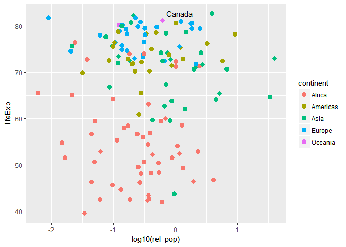

Hw02 - Explore Gapminder and use dplyr
================

Load gapminder dataset and tidyverse packages

``` r
library(gapminder)
library(tidyverse)
```

    ## Loading tidyverse: ggplot2
    ## Loading tidyverse: tibble
    ## Loading tidyverse: tidyr
    ## Loading tidyverse: readr
    ## Loading tidyverse: purrr
    ## Loading tidyverse: dplyr

    ## Conflicts with tidy packages ----------------------------------------------

    ## filter(): dplyr, stats
    ## lag():    dplyr, stats

Overview of gapminder data
--------------------------

``` r
class(gapminder)
```

    ## [1] "tbl_df"     "tbl"        "data.frame"

It is a data.frame, more specifically it is a tibble.

``` r
ncol(gapminder)
```

    ## [1] 6

``` r
nrow(gapminder)
```

    ## [1] 1704

``` r
dim(gapminder)
```

    ## [1] 1704    6

It has 6 columns and 1704 rows. These can also been seen from str():

``` r
str(gapminder)
```

    ## Classes 'tbl_df', 'tbl' and 'data.frame':    1704 obs. of  6 variables:
    ##  $ country  : Factor w/ 142 levels "Afghanistan",..: 1 1 1 1 1 1 1 1 1 1 ...
    ##  $ continent: Factor w/ 5 levels "Africa","Americas",..: 3 3 3 3 3 3 3 3 3 3 ...
    ##  $ year     : int  1952 1957 1962 1967 1972 1977 1982 1987 1992 1997 ...
    ##  $ lifeExp  : num  28.8 30.3 32 34 36.1 ...
    ##  $ pop      : int  8425333 9240934 10267083 11537966 13079460 14880372 12881816 13867957 16317921 22227415 ...
    ##  $ gdpPercap: num  779 821 853 836 740 ...

If you wanted a visual summary of all the info for you to read, str() or summary() are very useful. If you wanted just a 1 peice of info to use as an input into another function, then functions like ncol() are more useful. This also showed the data type of each variable.

Alternatively can get the data type of each variable individually:

``` r
typeof(gapminder$continent)
```

    ## [1] "integer"

Country, continent are factors. Year, Pop are int. lifeExp, gdpPercap are num.

Explore individual variables
----------------------------

Country
-------

``` r
unique(gapminder$country)
```

    ##   [1] Afghanistan              Albania                 
    ##   [3] Algeria                  Angola                  
    ##   [5] Argentina                Australia               
    ##   [7] Austria                  Bahrain                 
    ##   [9] Bangladesh               Belgium                 
    ##  [11] Benin                    Bolivia                 
    ##  [13] Bosnia and Herzegovina   Botswana                
    ##  [15] Brazil                   Bulgaria                
    ##  [17] Burkina Faso             Burundi                 
    ##  [19] Cambodia                 Cameroon                
    ##  [21] Canada                   Central African Republic
    ##  [23] Chad                     Chile                   
    ##  [25] China                    Colombia                
    ##  [27] Comoros                  Congo, Dem. Rep.        
    ##  [29] Congo, Rep.              Costa Rica              
    ##  [31] Cote d'Ivoire            Croatia                 
    ##  [33] Cuba                     Czech Republic          
    ##  [35] Denmark                  Djibouti                
    ##  [37] Dominican Republic       Ecuador                 
    ##  [39] Egypt                    El Salvador             
    ##  [41] Equatorial Guinea        Eritrea                 
    ##  [43] Ethiopia                 Finland                 
    ##  [45] France                   Gabon                   
    ##  [47] Gambia                   Germany                 
    ##  [49] Ghana                    Greece                  
    ##  [51] Guatemala                Guinea                  
    ##  [53] Guinea-Bissau            Haiti                   
    ##  [55] Honduras                 Hong Kong, China        
    ##  [57] Hungary                  Iceland                 
    ##  [59] India                    Indonesia               
    ##  [61] Iran                     Iraq                    
    ##  [63] Ireland                  Israel                  
    ##  [65] Italy                    Jamaica                 
    ##  [67] Japan                    Jordan                  
    ##  [69] Kenya                    Korea, Dem. Rep.        
    ##  [71] Korea, Rep.              Kuwait                  
    ##  [73] Lebanon                  Lesotho                 
    ##  [75] Liberia                  Libya                   
    ##  [77] Madagascar               Malawi                  
    ##  [79] Malaysia                 Mali                    
    ##  [81] Mauritania               Mauritius               
    ##  [83] Mexico                   Mongolia                
    ##  [85] Montenegro               Morocco                 
    ##  [87] Mozambique               Myanmar                 
    ##  [89] Namibia                  Nepal                   
    ##  [91] Netherlands              New Zealand             
    ##  [93] Nicaragua                Niger                   
    ##  [95] Nigeria                  Norway                  
    ##  [97] Oman                     Pakistan                
    ##  [99] Panama                   Paraguay                
    ## [101] Peru                     Philippines             
    ## [103] Poland                   Portugal                
    ## [105] Puerto Rico              Reunion                 
    ## [107] Romania                  Rwanda                  
    ## [109] Sao Tome and Principe    Saudi Arabia            
    ## [111] Senegal                  Serbia                  
    ## [113] Sierra Leone             Singapore               
    ## [115] Slovak Republic          Slovenia                
    ## [117] Somalia                  South Africa            
    ## [119] Spain                    Sri Lanka               
    ## [121] Sudan                    Swaziland               
    ## [123] Sweden                   Switzerland             
    ## [125] Syria                    Taiwan                  
    ## [127] Tanzania                 Thailand                
    ## [129] Togo                     Trinidad and Tobago     
    ## [131] Tunisia                  Turkey                  
    ## [133] Uganda                   United Kingdom          
    ## [135] United States            Uruguay                 
    ## [137] Venezuela                Vietnam                 
    ## [139] West Bank and Gaza       Yemen, Rep.             
    ## [141] Zambia                   Zimbabwe                
    ## 142 Levels: Afghanistan Albania Algeria Angola Argentina ... Zimbabwe

This shows all possible values for country (all countries included in dataset)

``` r
table(gapminder$country)
```

    ## 
    ##              Afghanistan                  Albania                  Algeria 
    ##                       12                       12                       12 
    ##                   Angola                Argentina                Australia 
    ##                       12                       12                       12 
    ##                  Austria                  Bahrain               Bangladesh 
    ##                       12                       12                       12 
    ##                  Belgium                    Benin                  Bolivia 
    ##                       12                       12                       12 
    ##   Bosnia and Herzegovina                 Botswana                   Brazil 
    ##                       12                       12                       12 
    ##                 Bulgaria             Burkina Faso                  Burundi 
    ##                       12                       12                       12 
    ##                 Cambodia                 Cameroon                   Canada 
    ##                       12                       12                       12 
    ## Central African Republic                     Chad                    Chile 
    ##                       12                       12                       12 
    ##                    China                 Colombia                  Comoros 
    ##                       12                       12                       12 
    ##         Congo, Dem. Rep.              Congo, Rep.               Costa Rica 
    ##                       12                       12                       12 
    ##            Cote d'Ivoire                  Croatia                     Cuba 
    ##                       12                       12                       12 
    ##           Czech Republic                  Denmark                 Djibouti 
    ##                       12                       12                       12 
    ##       Dominican Republic                  Ecuador                    Egypt 
    ##                       12                       12                       12 
    ##              El Salvador        Equatorial Guinea                  Eritrea 
    ##                       12                       12                       12 
    ##                 Ethiopia                  Finland                   France 
    ##                       12                       12                       12 
    ##                    Gabon                   Gambia                  Germany 
    ##                       12                       12                       12 
    ##                    Ghana                   Greece                Guatemala 
    ##                       12                       12                       12 
    ##                   Guinea            Guinea-Bissau                    Haiti 
    ##                       12                       12                       12 
    ##                 Honduras         Hong Kong, China                  Hungary 
    ##                       12                       12                       12 
    ##                  Iceland                    India                Indonesia 
    ##                       12                       12                       12 
    ##                     Iran                     Iraq                  Ireland 
    ##                       12                       12                       12 
    ##                   Israel                    Italy                  Jamaica 
    ##                       12                       12                       12 
    ##                    Japan                   Jordan                    Kenya 
    ##                       12                       12                       12 
    ##         Korea, Dem. Rep.              Korea, Rep.                   Kuwait 
    ##                       12                       12                       12 
    ##                  Lebanon                  Lesotho                  Liberia 
    ##                       12                       12                       12 
    ##                    Libya               Madagascar                   Malawi 
    ##                       12                       12                       12 
    ##                 Malaysia                     Mali               Mauritania 
    ##                       12                       12                       12 
    ##                Mauritius                   Mexico                 Mongolia 
    ##                       12                       12                       12 
    ##               Montenegro                  Morocco               Mozambique 
    ##                       12                       12                       12 
    ##                  Myanmar                  Namibia                    Nepal 
    ##                       12                       12                       12 
    ##              Netherlands              New Zealand                Nicaragua 
    ##                       12                       12                       12 
    ##                    Niger                  Nigeria                   Norway 
    ##                       12                       12                       12 
    ##                     Oman                 Pakistan                   Panama 
    ##                       12                       12                       12 
    ##                 Paraguay                     Peru              Philippines 
    ##                       12                       12                       12 
    ##                   Poland                 Portugal              Puerto Rico 
    ##                       12                       12                       12 
    ##                  Reunion                  Romania                   Rwanda 
    ##                       12                       12                       12 
    ##    Sao Tome and Principe             Saudi Arabia                  Senegal 
    ##                       12                       12                       12 
    ##                   Serbia             Sierra Leone                Singapore 
    ##                       12                       12                       12 
    ##          Slovak Republic                 Slovenia                  Somalia 
    ##                       12                       12                       12 
    ##             South Africa                    Spain                Sri Lanka 
    ##                       12                       12                       12 
    ##                    Sudan                Swaziland                   Sweden 
    ##                       12                       12                       12 
    ##              Switzerland                    Syria                   Taiwan 
    ##                       12                       12                       12 
    ##                 Tanzania                 Thailand                     Togo 
    ##                       12                       12                       12 
    ##      Trinidad and Tobago                  Tunisia                   Turkey 
    ##                       12                       12                       12 
    ##                   Uganda           United Kingdom            United States 
    ##                       12                       12                       12 
    ##                  Uruguay                Venezuela                  Vietnam 
    ##                       12                       12                       12 
    ##       West Bank and Gaza              Yemen, Rep.                   Zambia 
    ##                       12                       12                       12 
    ##                 Zimbabwe 
    ##                       12

``` r
barplot(table(gapminder$country))
```


These shows that each country occurs exactly 12 times. Graph is very ugly though (too many countries to see visually), it's easier to see this from the table above.

``` r
nrow(table(gapminder$country))
```

    ## [1] 142

There are 142 countries present.

``` r
filter(gapminder, country == "Canada") %>%
  select(country, year)
```

    ## # A tibble: 12 x 2
    ##    country  year
    ##     <fctr> <int>
    ##  1  Canada  1952
    ##  2  Canada  1957
    ##  3  Canada  1962
    ##  4  Canada  1967
    ##  5  Canada  1972
    ##  6  Canada  1977
    ##  7  Canada  1982
    ##  8  Canada  1987
    ##  9  Canada  1992
    ## 10  Canada  1997
    ## 11  Canada  2002
    ## 12  Canada  2007

This shows that for each of the 12 entries present for each country, each one corresponds to a different year (with 5 year intervals).

Pop
---

``` r
mean(gapminder$pop)
```

    ## [1] 29601212

``` r
median(gapminder$pop)
```

    ## [1] 7023596

``` r
range(gapminder$pop)
```

    ## [1]      60011 1318683096

The mean pop size is 29 million and the median is 7 million. The range is from 60,000 to 1.3 billion.

``` r
filter(gapminder, pop == 1318683096)
```

    ## # A tibble: 1 x 6
    ##   country continent  year lifeExp        pop gdpPercap
    ##    <fctr>    <fctr> <int>   <dbl>      <int>     <dbl>
    ## 1   China      Asia  2007  72.961 1318683096  4959.115

``` r
filter(gapminder, pop == 60011)
```

    ## # A tibble: 1 x 6
    ##                 country continent  year lifeExp   pop gdpPercap
    ##                  <fctr>    <fctr> <int>   <dbl> <int>     <dbl>
    ## 1 Sao Tome and Principe    Africa  1952  46.471 60011  879.5836

As suspected, China has the biggest pop! The smallest is Sao Tome and Principe, probably why I've never heard of them.

``` r
gapminder %>% 
  filter(year == 1997) %>% 
  arrange(desc(pop)) %>%
  select(country, pop) %>%
  head(10)
```

    ## # A tibble: 10 x 2
    ##          country        pop
    ##           <fctr>      <int>
    ##  1         China 1230075000
    ##  2         India  959000000
    ##  3 United States  272911760
    ##  4     Indonesia  199278000
    ##  5        Brazil  168546719
    ##  6      Pakistan  135564834
    ##  7         Japan  125956499
    ##  8    Bangladesh  123315288
    ##  9       Nigeria  106207839
    ## 10        Mexico   95895146

Here are the top 10 countries with largest population in 1997 in descending order.

We can also graph this as a barplot below, looking at the top 30 countries in Europe:

``` r
gapminder %>% 
  filter(year == 1997) %>%
  filter(continent == "Europe") %>% 
  arrange(desc(pop)) %>%
  head(30) %>% 
  ggplot(aes(x=country, y=pop)) + 
         geom_point(colour = "red", size = 2) +
         theme(axis.text.x=element_text(angle=45,hjust=1))
```


Looking at all populations:

``` r
hist(gapminder$pop)
```

 The vast majority of the pop's are small (less than 200 million) with very few larger outliers. Therefore there is a strong right skew.

Can also use ggplot to make a nicer version of the histogram:

``` r
ggplot(gapminder, aes(log10(gapminder$pop))) +
  geom_histogram(bins = 25, fill = "blue") +
  ggtitle("Count histogram for population size") +
  geom_vline(xintercept = mean(log10(gapminder$pop)), colour = 2, size = 2 )
```

 Here we are looking at a histogram of the counts for log10 of population size. Mean size is marked with the red line.

``` r
gapminder %>% 
  filter(country %in% c("Canada", "United States", "Mexico")) %>% 
  ggplot(aes(x = year, y = pop, colour = country)) +
  geom_point(aes(size = lifeExp)) +
  geom_smooth(lwd = 1, se = FALSE, method = "lm") +
  theme_bw() 
```


Here is the population size of 3 north american countries, as it changed over the years. Life expectancy is indicated by the size of the points.

Looking at the population of countries in 2007 relative to Canada, and how this effects lifeExp. Coloured based on continent and Canada data point is labelled.

``` r
pop_canada = filter(gapminder, year == 2007, country == "Canada") %>% 
  select(pop)

pop_canada <- as.numeric(pop_canada)
canada_only <- filter(gapminder, year == 2007, country == "Canada")

rel_pop = 5

gapminder %>%
  filter(year == 2007) %>% 
  mutate(rel_pop = pop / pop_canada) %>% 
  ggplot(aes(x=log10(rel_pop), y=lifeExp, colour = continent)) + 
    geom_point(size = 3) +
    geom_text(data=canada_only, label = "Canada", colour = "black", size = 4,
              hjust = 2, vjust=-1)
```



For some reason when I tried to knit the document it gave an error that object 'rel\_pop' could not be found. Adding the line rel\_pop = 5 to my code fixed this problem...

But I want to do more!
----------------------

``` r
filter(gapminder, country == c("Rwanda", "Afghanistan"))
```

    ## # A tibble: 12 x 6
    ##        country continent  year lifeExp      pop gdpPercap
    ##         <fctr>    <fctr> <int>   <dbl>    <int>     <dbl>
    ##  1 Afghanistan      Asia  1957  30.332  9240934  820.8530
    ##  2 Afghanistan      Asia  1967  34.020 11537966  836.1971
    ##  3 Afghanistan      Asia  1977  38.438 14880372  786.1134
    ##  4 Afghanistan      Asia  1987  40.822 13867957  852.3959
    ##  5 Afghanistan      Asia  1997  41.763 22227415  635.3414
    ##  6 Afghanistan      Asia  2007  43.828 31889923  974.5803
    ##  7      Rwanda    Africa  1952  40.000  2534927  493.3239
    ##  8      Rwanda    Africa  1962  43.000  3051242  597.4731
    ##  9      Rwanda    Africa  1972  44.600  3992121  590.5807
    ## 10      Rwanda    Africa  1982  46.218  5507565  881.5706
    ## 11      Rwanda    Africa  1992  23.599  7290203  737.0686
    ## 12      Rwanda    Africa  2002  43.413  7852401  785.6538

This did not quite work. It alternated between Rwanda and Afganistan as the country while it did the filtering. Therefore only half of the entries for each country were found (6 each instead of 12 each). If you look at the years you can see how it alternates.

Correct way:

``` r
filter(gapminder, country %in% c("Rwanda", "Afghanistan"))
```

    ## # A tibble: 24 x 6
    ##        country continent  year lifeExp      pop gdpPercap
    ##         <fctr>    <fctr> <int>   <dbl>    <int>     <dbl>
    ##  1 Afghanistan      Asia  1952  28.801  8425333  779.4453
    ##  2 Afghanistan      Asia  1957  30.332  9240934  820.8530
    ##  3 Afghanistan      Asia  1962  31.997 10267083  853.1007
    ##  4 Afghanistan      Asia  1967  34.020 11537966  836.1971
    ##  5 Afghanistan      Asia  1972  36.088 13079460  739.9811
    ##  6 Afghanistan      Asia  1977  38.438 14880372  786.1134
    ##  7 Afghanistan      Asia  1982  39.854 12881816  978.0114
    ##  8 Afghanistan      Asia  1987  40.822 13867957  852.3959
    ##  9 Afghanistan      Asia  1992  41.674 16317921  649.3414
    ## 10 Afghanistan      Asia  1997  41.763 22227415  635.3414
    ## # ... with 14 more rows

This gets all of intended data.

Progress report
---------------

It definetely took me a lot of time as I had to keep going back to the sites dplyr-end-single-table, cm005 notes, dplyr-intro, and googling things as they came up. But it was good as I learned a lot as I experimented with different functions.

I found using pipe easy and helpful. Trying to add a data label for a single data point (canada) was tough.


