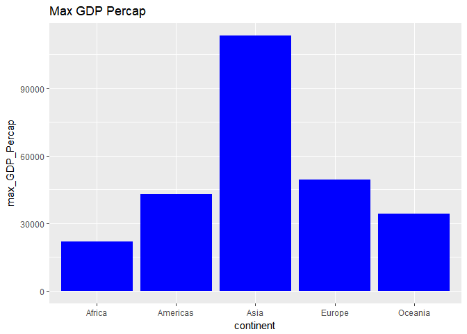
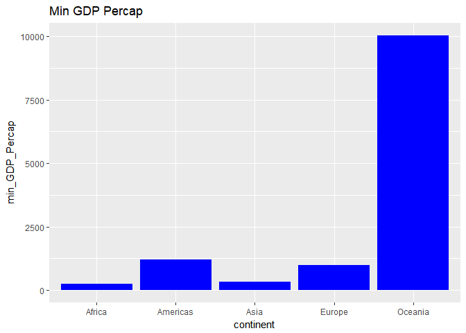
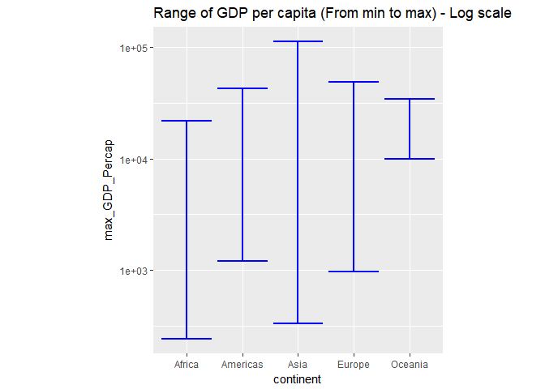
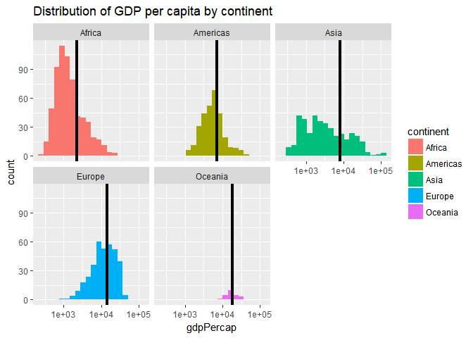
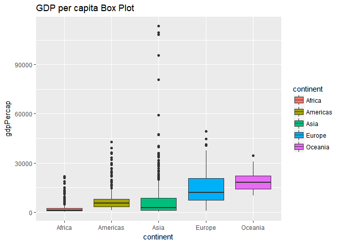
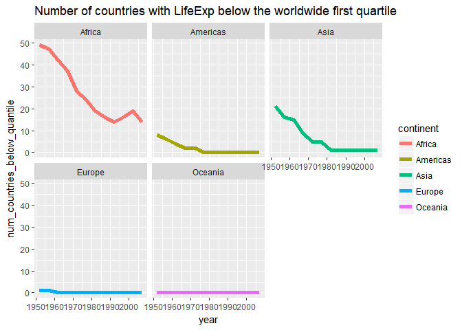
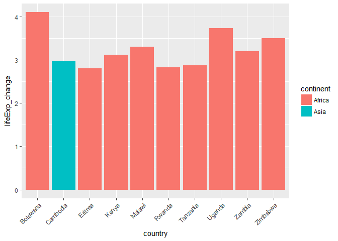
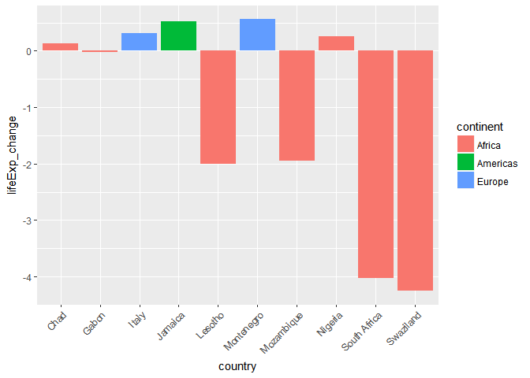

Homework 03 dplyr manipulation of gapminder dataset
================

Load packages:

``` r
suppressPackageStartupMessages(library(tidyverse))
suppressPackageStartupMessages(library(gapminder))

library(knitr)
library(kableExtra)  # did not end up using
```

    ## Warning: package 'kableExtra' was built under R version 3.4.2

Copy gapminder so don't overwrite it during manipulations:

``` r
my_gap <- gapminder
```

Get the maximum and minimum of GDP per capita for all continents
----------------------------------------------------------------

``` r
min_max_gdp <- my_gap %>% 
  group_by(continent) %>% 
  summarize(min_GDP_Percap = min(gdpPercap), 
            max_GDP_Percap = max(gdpPercap))


kable(min_max_gdp, align ="r", digit = 0)
```

|  continent|  min\_GDP\_Percap|  max\_GDP\_Percap|
|----------:|-----------------:|-----------------:|
|     Africa|               241|             21951|
|   Americas|              1202|             42952|
|       Asia|               331|            113523|
|     Europe|               974|             49357|
|    Oceania|             10040|             34435|

``` r
# kable(min_max_gdp, "html") %>%
#   kable_styling(bootstrap_options = "striped", full_width = F, position = "float_right")

# abandond the above code

# graph max gdp
min_max_gdp %>% 
  ggplot(aes(x = continent, y = max_GDP_Percap)) +
  geom_col(fill = "blue") +
  ggtitle("Max GDP Percap")
```



``` r
# graph min gdp
min_max_gdp %>% 
  ggplot(aes(x = continent, y = min_GDP_Percap)) +
  geom_col(fill = "blue") +
  ggtitle("Min GDP Percap")
```



``` r
# graph range 
min_max_gdp %>% 
  ggplot(aes(x = continent, y = max_GDP_Percap)) +
  geom_errorbar(aes(ymin = min_GDP_Percap,
                ymax = max_GDP_Percap),
                colour = 4,
                size = 1,
                linetype = 1) +
  ggtitle("Range of GDP per capita (From min to max) - Log scale") +
  scale_y_log10() +
  coord_fixed(ratio = 2)
```

 I made the first 2 graphs but then figured out a neat way to show both on the same graph. At first I tried seperate tables and then merging them, but nothing I did worked. I abandonded trying to make a grouped bar graph and instead used the errorplot function which worked nicely. The label on the y axis is wrong though as it should just say gdp percap without max.

We can see from the graphs/table that Oceana has by far the largest minimum GDP per capita, and Asia has the largest maximum GDP per capita. The range from min to max can also be seen from the third graph.

Look at the spread of GDP per capita within the continents.
-----------------------------------------------------------

``` r
## making table with mean, standard deviation, and standard error
my_gap_means <- my_gap %>% 
  group_by(continent) %>% 
  summarize(mean_GDP_percap = mean(gdpPercap),
            median_GDP_percap = median(gdpPercap),
            sd_GDP_percap = sd(gdpPercap),
            se_GDP_percap = sd(gdpPercap)/sqrt(length(gdpPercap)))  ## standard error of the mean

kable(min_max_gdp, align ="r", digit = 0)
```

|  continent|  min\_GDP\_Percap|  max\_GDP\_Percap|
|----------:|-----------------:|-----------------:|
|     Africa|               241|             21951|
|   Americas|              1202|             42952|
|       Asia|               331|            113523|
|     Europe|               974|             49357|
|    Oceania|             10040|             34435|

``` r
## plot seperate histogram for each continent
ggplot(my_gap, aes(gdpPercap)) +
  facet_wrap(~ continent) +
  geom_histogram(aes(fill = continent), bins = 20) +
  scale_x_log10() +
  ggtitle("Distribution of GDP per capita by continent") +
  geom_vline(data = my_gap_means, 
             aes(xintercept = mean_GDP_percap),  ## takes the mean values from the table made above
             colour = 1, size = 1.5)
```



``` r
## boxplot to show the distribution a different way and make outliers clearer.
my_gap %>% 
  ggplot(aes(x = continent, y = gdpPercap)) +
  geom_boxplot(aes(fill = continent)) +
  ggtitle("GDP per capita Box Plot")
```



For first graph, vertical line shows the mean value. It was tricky to get this to display correctly, following the facet rules( it was displayeing the same line location on all 5 graphs). Had to make changes to geom\_vline and called on the values stored in the table.

As we can see above, all continents except asia follow a somewhat normal + narrow distribution. Asia has an even spread. Box plot is useful to clearly show there are several very large outliers in Asia.

Report the absolute and/or relative abundance of countries with low life expectancy over time by continent: Compute some measure of worldwide life expectancy – you decide – a mean or median or some other quantile or perhaps your current age. Then determine how many countries on each continent have a life expectancy less than this benchmark, for each year.
---------------------------------------------------------------------------------------------------------------------------------------------------------------------------------------------------------------------------------------------------------------------------------------------------------------------------------------------------------------------

``` r
LifeExp_summary_table <-my_gap %>% 
  ## set benchmark as 1st quartile of worldwide life Exp
  mutate(first_quartile_lifeExp = sapply(lifeExp, function(method) quantile(lifeExp, 0.25)),
         ## determine if lifeExp is below 1st quartile (T or F) for each
         below_quantile = (lifeExp - first_quartile_lifeExp < 0)) %>% 
  ## print(LifeExp_summary_table) ## used to check progress
  group_by(continent, year) %>% 
  ## count the absolute number of countries in each continent (by year) that are below
  ## which() returns a vector of the entries that are TRUE
  ## so we look at how many entries are in this vector with length()
  summarize(num_countries_below_quantile = length(which(below_quantile))) 


kable(LifeExp_summary_table, align ="r")
```

|  continent|  year|  num\_countries\_below\_quantile|
|----------:|-----:|--------------------------------:|
|     Africa|  1952|                               49|
|     Africa|  1957|                               47|
|     Africa|  1962|                               42|
|     Africa|  1967|                               37|
|     Africa|  1972|                               28|
|     Africa|  1977|                               24|
|     Africa|  1982|                               19|
|     Africa|  1987|                               16|
|     Africa|  1992|                               14|
|     Africa|  1997|                               16|
|     Africa|  2002|                               19|
|     Africa|  2007|                               14|
|   Americas|  1952|                                8|
|   Americas|  1957|                                6|
|   Americas|  1962|                                4|
|   Americas|  1967|                                2|
|   Americas|  1972|                                2|
|   Americas|  1977|                                0|
|   Americas|  1982|                                0|
|   Americas|  1987|                                0|
|   Americas|  1992|                                0|
|   Americas|  1997|                                0|
|   Americas|  2002|                                0|
|   Americas|  2007|                                0|
|       Asia|  1952|                               21|
|       Asia|  1957|                               16|
|       Asia|  1962|                               15|
|       Asia|  1967|                                9|
|       Asia|  1972|                                5|
|       Asia|  1977|                                5|
|       Asia|  1982|                                1|
|       Asia|  1987|                                1|
|       Asia|  1992|                                1|
|       Asia|  1997|                                1|
|       Asia|  2002|                                1|
|       Asia|  2007|                                1|
|     Europe|  1952|                                1|
|     Europe|  1957|                                1|
|     Europe|  1962|                                0|
|     Europe|  1967|                                0|
|     Europe|  1972|                                0|
|     Europe|  1977|                                0|
|     Europe|  1982|                                0|
|     Europe|  1987|                                0|
|     Europe|  1992|                                0|
|     Europe|  1997|                                0|
|     Europe|  2002|                                0|
|     Europe|  2007|                                0|
|    Oceania|  1952|                                0|
|    Oceania|  1957|                                0|
|    Oceania|  1962|                                0|
|    Oceania|  1967|                                0|
|    Oceania|  1972|                                0|
|    Oceania|  1977|                                0|
|    Oceania|  1982|                                0|
|    Oceania|  1987|                                0|
|    Oceania|  1992|                                0|
|    Oceania|  1997|                                0|
|    Oceania|  2002|                                0|
|    Oceania|  2007|                                0|

``` r
LifeExp_summary_table %>% 
  ggplot(aes(x = year, y = num_countries_below_quantile, colour = continent)) +
  facet_wrap(~ continent) +
  geom_line(size = 2) +
  ggtitle('Number of countries with LifeExp below the worldwide first quartile - by continent')
```

 First quartile of worldwide lifeExp is 48.2 years old, so 25% of lifeExp's are below this. Using this as our cutoff we can see that very few countries met this criteria in Europe, Oceana, and the Americas. In all continents the number decreases and by 2007 only Africa has a few (Asia technically also has 1).

To do this I calculated a logical (true if below cutoff) and then counted the number of entries that were true.

Find countries with interesting stories...Lets see if any countries have significant changes in lifeExp between 2002 and 2007
-----------------------------------------------------------------------------------------------------------------------------

``` r
## top 10 countries fold change from 2002 to 2007
my_gap %>%
  filter(year == 2002 | year == 2007) %>% 
  group_by(country) %>% 
  arrange(year) %>% 
  mutate(lifeExp_change = lifeExp[year==2007] - lifeExp[year==2002]) %>% 
  arrange(desc(lifeExp_change)) %>% 
  filter(year == 2007) %>% ## filter again so only 1 entry per country
  select(country, continent, lifeExp_change) %>% ## get rid of other columns
  head(10) %>%  # get just top 10
  kable(align = "r", digits = 1) ## print top 10 countries
```

|   country|  continent|  lifeExp\_change|
|---------:|----------:|----------------:|
|  Botswana|     Africa|              4.1|
|    Uganda|     Africa|              3.7|
|  Zimbabwe|     Africa|              3.5|
|    Malawi|     Africa|              3.3|
|    Zambia|     Africa|              3.2|
|     Kenya|     Africa|              3.1|
|  Cambodia|       Asia|              3.0|
|  Tanzania|     Africa|              2.9|
|    Rwanda|     Africa|              2.8|
|   Eritrea|     Africa|              2.8|

``` r
## bottom 10 countries fold change from 2002 to 2007
my_gap %>%
  filter(year == 2002 | year == 2007) %>% 
  group_by(country) %>% 
  arrange(year) %>% 
  mutate(lifeExp_change = lifeExp[year==2007] - lifeExp[year==2002]) %>% 
  arrange(lifeExp_change) %>% 
  filter(year == 2007) %>% ## filter again so only 1 entry per country
  select(country, continent, lifeExp_change) %>% ## get rid of other columns
  head(10) %>%  # get just top 10
  kable(align = "r", digits = 1) ## print bottom 10 countries
```

|          country|   continent|                                                                                     lifeExp\_change|
|----------------:|-----------:|---------------------------------------------------------------------------------------------------:|
|        Swaziland|      Africa|                                                                                                -4.3|
|     South Africa|      Africa|                                                                                                -4.0|
|          Lesotho|      Africa|                                                                                                -2.0|
|       Mozambique|      Africa|                                                                                                -1.9|
|            Gabon|      Africa|                                                                                                 0.0|
|             Chad|      Africa|                                                                                                 0.1|
|          Nigeria|      Africa|                                                                                                 0.3|
|            Italy|      Europe|                                                                                                 0.3|
|          Jamaica|    Americas|                                                                                                 0.5|
|       Montenegro|      Europe|                                                                                                 0.6|
|  Here we can see|  the top 10|  countries with the largest positive and negative changes in life expectancy between 2002 and 2007.|

I later added the continents to the tables to see if there's any patterns in where these countries are from. Very interestinly, the majority of countries in both tables are from Africa. This means both the largest positive and negative changes were here. Guess this indicates instability in the region over those 5 years.

``` r
## bottom 10 countries fold change from 2002 to 2007
my_gap %>%
  filter(year == 2002 | year == 2007) %>% 
  group_by(country) %>% 
  arrange(year) %>% 
  mutate(lifeExp_change = lifeExp[year==2007] - lifeExp[year==2002]) %>% 
  arrange(desc(lifeExp_change)) %>% 
  filter(year == 2007) %>% ## filter again so only 1 entry per country
  select(country, continent, lifeExp_change) %>% ## get rid of other columns
  head(10) %>%  # get just top 10
  ggplot(aes(x=country, y=lifeExp_change, fill = continent)) +
  geom_col() +
  theme(axis.text.x=element_text(angle=45,hjust=1))
```



``` r
## bottom 10 countries fold change from 2002 to 2007
my_gap %>%
  filter(year == 2002 | year == 2007) %>% 
  group_by(country) %>% 
  arrange(year) %>% 
  mutate(lifeExp_change = lifeExp[year==2007] - lifeExp[year==2002]) %>% 
  arrange(lifeExp_change) %>% 
  filter(year == 2007) %>% ## filter again so only 1 entry per country
  select(country, continent, lifeExp_change) %>% ## get rid of other columns
  head(10) %>%  # get just top 10
  ggplot(aes(x=country, y=lifeExp_change, fill = continent)) +
  geom_col() +
  theme(axis.text.x=element_text(angle=45,hjust=1))
```

 This can also be seen from the graphs. Code is same as from tables except with ggplot instead of kable.If I was to do this again, instead of copy pasting all the code (gets mesy) I could have saved it to a variable and then called on that.

Progress Report
---------------

As suggested in the instructions, I tried playing around with the display format to get the tables and graphs side by side, as well as trying different table display formats. Mostly I couldn't get these working and what did work I wasn't a fan of, so I didn't bother.

Also learned I don't like tables...ended up spending more time playing around with ggplot (if that wasn't obvious)
