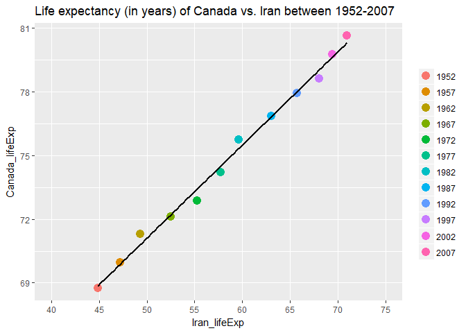

Homework 04: Tidy data and joins
================

Load Packages:

``` r
suppressPackageStartupMessages(library(dplyr))
suppressPackageStartupMessages(library(gapminder))
suppressPackageStartupMessages(library(tidyr))
suppressPackageStartupMessages(library(readr))
suppressPackageStartupMessages(library(knitr))
suppressPackageStartupMessages(library(tidyverse))
```

Activity \#2
------------

Make a tibble with one row per year and columns for life expectancy for two or more countries. Use knitr::kable() to make this table look pretty in your rendered homework. Take advantage of this new data shape to scatter plot life expectancy for one country against that of another.

``` r
one_row_per_year <- gapminder %>%
  select(year, country, lifeExp) %>% 
  ### Filter down to two countries
  filter(country %in% c("Canada", "Iran")) %>% 
  ### create 2 columns with lifeExp values
  spread(key = country, value = lifeExp) %>%
  ## rename columns to indicate what values correspoind to 
  rename(Canada_lifeExp = Canada, Iran_lifeExp = Iran) %>%   
  arrange(year)


kable(one_row_per_year, align ="r", digit = 0)
```

|  year|  Canada\_lifeExp|  Iran\_lifeExp|
|-----:|----------------:|--------------:|
|  1952|               69|             45|
|  1957|               70|             47|
|  1962|               71|             49|
|  1967|               72|             52|
|  1972|               73|             55|
|  1977|               74|             58|
|  1982|               76|             60|
|  1987|               77|             63|
|  1992|               78|             66|
|  1997|               79|             68|
|  2002|               80|             69|
|  2007|               81|             71|

Now we can graph this as a scatter plot. I am taking the instructions literally, aka each axis is the lifeExp for one of the countries (x axis is not years).

``` r
one_row_per_year %>% 
  ggplot(aes(x = Iran_lifeExp, y = Canada_lifeExp, colour = factor(year) )) +
  geom_point(size = 4) +
  geom_smooth(colour = 1, method = 'lm', se = FALSE) +
  ggtitle("Life expectancy (in years) of Canada vs. Iran between 1952-2007 ") +
  scale_x_continuous(labels = as.character(seq(40, 75, 5)),
                     breaks = seq(40, 75, 5), 
                     limits = c(40, 75),
                     minor_breaks = NULL) +
  theme(legend.title = element_blank())
```



I tried to get the legend title to read years instead of factor(years) but couldn't, so I just removed it. Anyways, we can see a strong linear relationship between the life expectancy increase of Iran and Canada over the years.

### Part 1 reflection

I was stuck on this for a while trying to use gather. Then I thought about trying to make to separate tables and then joining the two tables together. Then realized a similar thing could actually work with spread! After that it was pretty easy, and I've gotten quite familiar with ggplot at this point (though it seems there's always more features that could be added to a plot).

Join, merge, look up
--------------------

Create a second data frame, complementary to Gapminder. Join this with (part of) Gapminder using a dplyr join function and make some observations about the process and result. Explore the different types of joins.

``` r
diabetes_rates <- read.csv("diabtes_ratesedit.csv") %>% 
  rename(country = Country_Name) ### so it has same column name as gapminder

head(diabetes_rates, 20)
```

    ##                 country Diabetes_prevalance_2015
    ## 1                 Aruba                 11.70000
    ## 2           Afghanistan                  8.80000
    ## 3                Angola                  4.10000
    ## 4               Albania                 10.30000
    ## 5               Andorra                  8.50000
    ## 6            Arab World                 11.91781
    ## 7  United Arab Emirates                 19.30000
    ## 8             Argentina                  6.00000
    ## 9               Armenia                  6.40000
    ## 10       American Samoa                       NA
    ## 11  Antigua and Barbuda                 13.60000
    ## 12            Australia                  5.10000
    ## 13              Austria                  6.90000
    ## 14           Azerbaijan                  6.50000
    ## 15              Burundi                  2.70000
    ## 16              Belgium                  5.10000
    ## 17                Benin                  0.80000
    ## 18         Burkina Faso                  2.20000
    ## 19           Bangladesh                  8.30000
    ## 20             Bulgaria                  5.90000

``` r
class(diabetes_rates)  ### check the format
```

    ## [1] "data.frame"

Found data from the world bank website on the % prevalence of of diabetes for each country, in 2015. Seemed like a cool idea since I work in diabetes research. I had to make a couple edits to the .csv file in excel so it would play nicely in R.

Filter our data down to make things easier to work with. Lets just look at countries in Asia, years 2002 and 2007, and only look at the columns country, lifeExp, and year.

``` r
gapminder_02_07 <- gapminder %>%
  filter(year == 2007 | year == 2002) %>% 
  filter(continent == "Asia") %>% 
  select(country, lifeExp, year)

gapminder_02_07
```

    ## # A tibble: 66 x 3
    ##        country lifeExp  year
    ##         <fctr>   <dbl> <int>
    ##  1 Afghanistan  42.129  2002
    ##  2 Afghanistan  43.828  2007
    ##  3     Bahrain  74.795  2002
    ##  4     Bahrain  75.635  2007
    ##  5  Bangladesh  62.013  2002
    ##  6  Bangladesh  64.062  2007
    ##  7    Cambodia  56.752  2002
    ##  8    Cambodia  59.723  2007
    ##  9       China  72.028  2002
    ## 10       China  72.961  2007
    ## # ... with 56 more rows

Try joining it with gapminder\_02\_07 a few different ways:

``` r
left_join(gapminder_02_07, diabetes_rates)
```

    ## Joining, by = "country"

    ## Warning: Column `country` joining factors with different levels, coercing
    ## to character vector

    ## # A tibble: 66 x 4
    ##        country lifeExp  year Diabetes_prevalance_2015
    ##          <chr>   <dbl> <int>                    <dbl>
    ##  1 Afghanistan  42.129  2002                      8.8
    ##  2 Afghanistan  43.828  2007                      8.8
    ##  3     Bahrain  74.795  2002                     19.6
    ##  4     Bahrain  75.635  2007                     19.6
    ##  5  Bangladesh  62.013  2002                      8.3
    ##  6  Bangladesh  64.062  2007                      8.3
    ##  7    Cambodia  56.752  2002                      3.0
    ##  8    Cambodia  59.723  2007                      3.0
    ##  9       China  72.028  2002                      9.8
    ## 10       China  72.961  2007                      9.8
    ## # ... with 56 more rows

**Left\_join** takes everything from the gapminder\_02\_07 data frame, and then adds columns for the diabetes data frame. If a country in gapminder\_02\_07 is missing from diabetes\_rates, then it puts an 'NA' in the diabetes column. This join function is probably the most practical for real use based on my original idea.

``` r
right_join(gapminder_02_07, diabetes_rates)
```

    ## Joining, by = "country"

    ## Warning: Column `country` joining factors with different levels, coercing
    ## to character vector

    ## # A tibble: 292 x 4
    ##                 country lifeExp  year Diabetes_prevalance_2015
    ##                   <chr>   <dbl> <int>                    <dbl>
    ##  1                Aruba      NA    NA                 11.70000
    ##  2          Afghanistan  42.129  2002                  8.80000
    ##  3          Afghanistan  43.828  2007                  8.80000
    ##  4               Angola      NA    NA                  4.10000
    ##  5              Albania      NA    NA                 10.30000
    ##  6              Andorra      NA    NA                  8.50000
    ##  7           Arab World      NA    NA                 11.91781
    ##  8 United Arab Emirates      NA    NA                 19.30000
    ##  9            Argentina      NA    NA                  6.00000
    ## 10              Armenia      NA    NA                  6.40000
    ## # ... with 282 more rows

With **right\_join**, this does the opposite of left join. It takes countries from diabetes\_rates and adds columns for gapminder\_02\_07 Here we can see there are a lot of "NA" in lifeExp and year. This indicates diabetes\_rates has a lot more countries than gapminder\_02\_07 (because gapminder was limited to just Asia here). Interestingly there are a couple countries that were listed in diabetes\_rates but did not have diabetes data, so all their columns are "NA". There are still 2 rows per country.

``` r
semi_join(gapminder_02_07, diabetes_rates)
```

    ## Joining, by = "country"

    ## Warning: Column `country` joining factors with different levels, coercing
    ## to character vector

    ## # A tibble: 56 x 3
    ##        country lifeExp  year
    ##         <fctr>   <dbl> <int>
    ##  1 Afghanistan  42.129  2002
    ##  2 Afghanistan  43.828  2007
    ##  3  Bangladesh  62.013  2002
    ##  4  Bangladesh  64.062  2007
    ##  5     Bahrain  74.795  2002
    ##  6     Bahrain  75.635  2007
    ##  7       China  72.028  2002
    ##  8       China  72.961  2007
    ##  9   Indonesia  68.588  2002
    ## 10   Indonesia  70.650  2007
    ## # ... with 46 more rows

**Semi\_join** did not add the diabetes\_prevalence column, but instead filtered down gapminder\_02\_07 so that only countries that were also in diabetes\_rates were kept. About 10 rows were removed, these removed rows correspond to the rows in left\_join with "NA".

``` r
inner_join(gapminder_02_07, diabetes_rates)
```

    ## Joining, by = "country"

    ## Warning: Column `country` joining factors with different levels, coercing
    ## to character vector

    ## # A tibble: 56 x 4
    ##        country lifeExp  year Diabetes_prevalance_2015
    ##          <chr>   <dbl> <int>                    <dbl>
    ##  1 Afghanistan  42.129  2002                      8.8
    ##  2 Afghanistan  43.828  2007                      8.8
    ##  3     Bahrain  74.795  2002                     19.6
    ##  4     Bahrain  75.635  2007                     19.6
    ##  5  Bangladesh  62.013  2002                      8.3
    ##  6  Bangladesh  64.062  2007                      8.3
    ##  7    Cambodia  56.752  2002                      3.0
    ##  8    Cambodia  59.723  2007                      3.0
    ##  9       China  72.028  2002                      9.8
    ## 10       China  72.961  2007                      9.8
    ## # ... with 46 more rows

**Inner\_join** appears to be the same as semi\_join in how it filtered down the rows, except that it also added the diabetes\_prev column. So here there are no "NA"'s and we have all rows that match between both data sets.

``` r
anti_join(gapminder_02_07, diabetes_rates)
```

    ## Joining, by = "country"

    ## Warning: Column `country` joining factors with different levels, coercing
    ## to character vector

    ## # A tibble: 10 x 3
    ##             country lifeExp  year
    ##              <fctr>   <dbl> <int>
    ##  1            Syria  73.053  2002
    ##  2            Syria  74.143  2007
    ##  3 Hong Kong, China  81.495  2002
    ##  4 Hong Kong, China  82.208  2007
    ##  5 Korea, Dem. Rep.  66.662  2002
    ##  6 Korea, Dem. Rep.  67.297  2007
    ##  7           Taiwan  76.990  2002
    ##  8           Taiwan  78.400  2007
    ##  9             Iran  69.451  2002
    ## 10             Iran  70.964  2007

**Anti\_join** works similar to semi\_join, but instead of returning the 56 rows that matched, it returns the 10 rows from gapminder that were not in diabetes\_rates.

``` r
full_join(gapminder_02_07, diabetes_rates)
```

    ## Joining, by = "country"

    ## Warning: Column `country` joining factors with different levels, coercing
    ## to character vector

    ## # A tibble: 302 x 4
    ##        country lifeExp  year Diabetes_prevalance_2015
    ##          <chr>   <dbl> <int>                    <dbl>
    ##  1 Afghanistan  42.129  2002                      8.8
    ##  2 Afghanistan  43.828  2007                      8.8
    ##  3     Bahrain  74.795  2002                     19.6
    ##  4     Bahrain  75.635  2007                     19.6
    ##  5  Bangladesh  62.013  2002                      8.3
    ##  6  Bangladesh  64.062  2007                      8.3
    ##  7    Cambodia  56.752  2002                      3.0
    ##  8    Cambodia  59.723  2007                      3.0
    ##  9       China  72.028  2002                      9.8
    ## 10       China  72.961  2007                      9.8
    ## # ... with 292 more rows

Full Join keeps all countries present in either data set. Therefore this creates a data set with more rows than any of the above joins.

That's all the joins!!! I was a little surprised that they all kept both years (2 rows per country). That was the whole reason I chose to leave in 2 years instead of 1.

Let's take a look at activity \#3 too:

``` r
merge(gapminder_02_07, diabetes_rates)
```

    ##               country lifeExp year Diabetes_prevalance_2015
    ## 1         Afghanistan  43.828 2007                      8.8
    ## 2         Afghanistan  42.129 2002                      8.8
    ## 3             Bahrain  74.795 2002                     19.6
    ## 4             Bahrain  75.635 2007                     19.6
    ## 5          Bangladesh  64.062 2007                      8.3
    ## 6          Bangladesh  62.013 2002                      8.3
    ## 7            Cambodia  59.723 2007                      3.0
    ## 8            Cambodia  56.752 2002                      3.0
    ## 9               China  72.028 2002                      9.8
    ## 10              China  72.961 2007                      9.8
    ## 11              India  62.879 2002                      9.3
    ## 12              India  64.698 2007                      9.3
    ## 13          Indonesia  68.588 2002                      6.5
    ## 14          Indonesia  70.650 2007                      6.5
    ## 15               Iraq  59.545 2007                      9.3
    ## 16               Iraq  57.046 2002                      9.3
    ## 17             Israel  79.696 2002                      7.5
    ## 18             Israel  80.745 2007                      7.5
    ## 19              Japan  82.000 2002                      5.7
    ## 20              Japan  82.603 2007                      5.7
    ## 21             Jordan  71.263 2002                     11.7
    ## 22             Jordan  72.535 2007                     11.7
    ## 23        Korea, Rep.  77.045 2002                      7.2
    ## 24        Korea, Rep.  78.623 2007                      7.2
    ## 25             Kuwait  77.588 2007                     20.0
    ## 26             Kuwait  76.904 2002                     20.0
    ## 27            Lebanon  71.028 2002                     13.0
    ## 28            Lebanon  71.993 2007                     13.0
    ## 29           Malaysia  73.044 2002                     17.9
    ## 30           Malaysia  74.241 2007                     17.9
    ## 31           Mongolia  65.033 2002                      5.4
    ## 32           Mongolia  66.803 2007                      5.4
    ## 33            Myanmar  59.908 2002                      6.8
    ## 34            Myanmar  62.069 2007                      6.8
    ## 35              Nepal  61.340 2002                      3.7
    ## 36              Nepal  63.785 2007                      3.7
    ## 37               Oman  74.193 2002                     14.8
    ## 38               Oman  75.640 2007                     14.8
    ## 39           Pakistan  65.483 2007                      8.1
    ## 40           Pakistan  63.610 2002                      8.1
    ## 41        Philippines  70.303 2002                      6.9
    ## 42        Philippines  71.688 2007                      6.9
    ## 43       Saudi Arabia  71.626 2002                     20.0
    ## 44       Saudi Arabia  72.777 2007                     20.0
    ## 45          Singapore  78.770 2002                     10.5
    ## 46          Singapore  79.972 2007                     10.5
    ## 47          Sri Lanka  70.815 2002                      8.0
    ## 48          Sri Lanka  72.396 2007                      8.0
    ## 49           Thailand  68.564 2002                      7.1
    ## 50           Thailand  70.616 2007                      7.1
    ## 51            Vietnam  73.017 2002                      6.0
    ## 52            Vietnam  74.249 2007                      6.0
    ## 53 West Bank and Gaza  72.370 2002                      9.4
    ## 54 West Bank and Gaza  73.422 2007                      9.4
    ## 55        Yemen, Rep.  60.308 2002                      5.1
    ## 56        Yemen, Rep.  62.698 2007                      5.1

It looks like **merge()** functioned very similarly to inner\_join, keeping only countries from gapminder\_02\_07 for which there was a value in diabetes\_prev.

``` r
merge(gapminder_02_07, diabetes_rates, all.y = TRUE)
```

    ##                                                  country lifeExp year
    ## 1                                            Afghanistan  43.828 2007
    ## 2                                            Afghanistan  42.129 2002
    ## 3                                                Albania      NA   NA
    ## 4                                                Algeria      NA   NA
    ## 5                                                 Angola      NA   NA
    ## 6                                              Argentina      NA   NA
    ## 7                                              Australia      NA   NA
    ## 8                                                Austria      NA   NA
    ## 9                                                Bahrain  74.795 2002
    ## 10                                               Bahrain  75.635 2007
    ## 11                                            Bangladesh  64.062 2007
    ## 12                                            Bangladesh  62.013 2002
    ## 13                                               Belgium      NA   NA
    ## 14                                                 Benin      NA   NA
    ## 15                                               Bolivia      NA   NA
    ## 16                                Bosnia and Herzegovina      NA   NA
    ## 17                                              Botswana      NA   NA
    ## 18                                                Brazil      NA   NA
    ## 19                                              Bulgaria      NA   NA
    ## 20                                          Burkina Faso      NA   NA
    ## 21                                               Burundi      NA   NA
    ## 22                                              Cambodia  59.723 2007
    ## 23                                              Cambodia  56.752 2002
    ## 24                                              Cameroon      NA   NA
    ## 25                                                Canada      NA   NA
    ## 26                              Central African Republic      NA   NA
    ## 27                                                  Chad      NA   NA
    ## 28                                                 Chile      NA   NA
    ## 29                                                 China  72.028 2002
    ## 30                                                 China  72.961 2007
    ## 31                                              Colombia      NA   NA
    ## 32                                               Comoros      NA   NA
    ## 33                                      Congo, Dem. Rep.      NA   NA
    ## 34                                           Congo, Rep.      NA   NA
    ## 35                                            Costa Rica      NA   NA
    ## 36                                         Cote d'Ivoire      NA   NA
    ## 37                                               Croatia      NA   NA
    ## 38                                                  Cuba      NA   NA
    ## 39                                        Czech Republic      NA   NA
    ## 40                                               Denmark      NA   NA
    ## 41                                              Djibouti      NA   NA
    ## 42                                    Dominican Republic      NA   NA
    ## 43                                               Ecuador      NA   NA
    ## 44                                           El Salvador      NA   NA
    ## 45                                     Equatorial Guinea      NA   NA
    ## 46                                               Eritrea      NA   NA
    ## 47                                              Ethiopia      NA   NA
    ## 48                                               Finland      NA   NA
    ## 49                                                France      NA   NA
    ## 50                                                 Gabon      NA   NA
    ## 51                                               Germany      NA   NA
    ## 52                                                 Ghana      NA   NA
    ## 53                                                Greece      NA   NA
    ## 54                                             Guatemala      NA   NA
    ## 55                                                Guinea      NA   NA
    ## 56                                         Guinea-Bissau      NA   NA
    ## 57                                                 Haiti      NA   NA
    ## 58                                              Honduras      NA   NA
    ## 59                                               Hungary      NA   NA
    ## 60                                               Iceland      NA   NA
    ## 61                                                 India  62.879 2002
    ## 62                                                 India  64.698 2007
    ## 63                                             Indonesia  68.588 2002
    ## 64                                             Indonesia  70.650 2007
    ## 65                                                  Iraq  59.545 2007
    ## 66                                                  Iraq  57.046 2002
    ## 67                                               Ireland      NA   NA
    ## 68                                                Israel  79.696 2002
    ## 69                                                Israel  80.745 2007
    ## 70                                                 Italy      NA   NA
    ## 71                                               Jamaica      NA   NA
    ## 72                                                 Japan  82.000 2002
    ## 73                                                 Japan  82.603 2007
    ## 74                                                Jordan  71.263 2002
    ## 75                                                Jordan  72.535 2007
    ## 76                                                 Kenya      NA   NA
    ## 77                                           Korea, Rep.  77.045 2002
    ## 78                                           Korea, Rep.  78.623 2007
    ## 79                                                Kuwait  77.588 2007
    ## 80                                                Kuwait  76.904 2002
    ## 81                                               Lebanon  71.028 2002
    ## 82                                               Lebanon  71.993 2007
    ## 83                                               Lesotho      NA   NA
    ## 84                                               Liberia      NA   NA
    ## 85                                                 Libya      NA   NA
    ## 86                                            Madagascar      NA   NA
    ## 87                                                Malawi      NA   NA
    ## 88                                              Malaysia  73.044 2002
    ## 89                                              Malaysia  74.241 2007
    ## 90                                                  Mali      NA   NA
    ## 91                                            Mauritania      NA   NA
    ## 92                                             Mauritius      NA   NA
    ## 93                                                Mexico      NA   NA
    ## 94                                              Mongolia  65.033 2002
    ## 95                                              Mongolia  66.803 2007
    ## 96                                            Montenegro      NA   NA
    ## 97                                               Morocco      NA   NA
    ## 98                                            Mozambique      NA   NA
    ## 99                                               Myanmar  59.908 2002
    ## 100                                              Myanmar  62.069 2007
    ## 101                                              Namibia      NA   NA
    ## 102                                                Nepal  61.340 2002
    ## 103                                                Nepal  63.785 2007
    ## 104                                          Netherlands      NA   NA
    ## 105                                          New Zealand      NA   NA
    ## 106                                            Nicaragua      NA   NA
    ## 107                                                Niger      NA   NA
    ## 108                                              Nigeria      NA   NA
    ## 109                                               Norway      NA   NA
    ## 110                                                 Oman  74.193 2002
    ## 111                                                 Oman  75.640 2007
    ## 112                                             Pakistan  65.483 2007
    ## 113                                             Pakistan  63.610 2002
    ## 114                                               Panama      NA   NA
    ## 115                                             Paraguay      NA   NA
    ## 116                                                 Peru      NA   NA
    ## 117                                          Philippines  70.303 2002
    ## 118                                          Philippines  71.688 2007
    ## 119                                               Poland      NA   NA
    ## 120                                             Portugal      NA   NA
    ## 121                                          Puerto Rico      NA   NA
    ## 122                                              Romania      NA   NA
    ## 123                                               Rwanda      NA   NA
    ## 124                                Sao Tome and Principe      NA   NA
    ## 125                                         Saudi Arabia  71.626 2002
    ## 126                                         Saudi Arabia  72.777 2007
    ## 127                                              Senegal      NA   NA
    ## 128                                               Serbia      NA   NA
    ## 129                                         Sierra Leone      NA   NA
    ## 130                                            Singapore  78.770 2002
    ## 131                                            Singapore  79.972 2007
    ## 132                                      Slovak Republic      NA   NA
    ## 133                                             Slovenia      NA   NA
    ## 134                                              Somalia      NA   NA
    ## 135                                         South Africa      NA   NA
    ## 136                                                Spain      NA   NA
    ## 137                                            Sri Lanka  70.815 2002
    ## 138                                            Sri Lanka  72.396 2007
    ## 139                                                Sudan      NA   NA
    ## 140                                            Swaziland      NA   NA
    ## 141                                               Sweden      NA   NA
    ## 142                                          Switzerland      NA   NA
    ## 143                                             Tanzania      NA   NA
    ## 144                                             Thailand  68.564 2002
    ## 145                                             Thailand  70.616 2007
    ## 146                                                 Togo      NA   NA
    ## 147                                  Trinidad and Tobago      NA   NA
    ## 148                                              Tunisia      NA   NA
    ## 149                                               Turkey      NA   NA
    ## 150                                               Uganda      NA   NA
    ## 151                                       United Kingdom      NA   NA
    ## 152                                        United States      NA   NA
    ## 153                                              Uruguay      NA   NA
    ## 154                                              Vietnam  73.017 2002
    ## 155                                              Vietnam  74.249 2007
    ## 156                                   West Bank and Gaza  72.370 2002
    ## 157                                   West Bank and Gaza  73.422 2007
    ## 158                                          Yemen, Rep.  60.308 2002
    ## 159                                          Yemen, Rep.  62.698 2007
    ## 160                                               Zambia      NA   NA
    ## 161                                             Zimbabwe      NA   NA
    ## 162                                       American Samoa      NA   NA
    ## 163                                              Andorra      NA   NA
    ## 164                                  Antigua and Barbuda      NA   NA
    ## 165                                           Arab World      NA   NA
    ## 166                                              Armenia      NA   NA
    ## 167                                                Aruba      NA   NA
    ## 168                                           Azerbaijan      NA   NA
    ## 169                                         Bahamas, The      NA   NA
    ## 170                                             Barbados      NA   NA
    ## 171                                              Belarus      NA   NA
    ## 172                                               Belize      NA   NA
    ## 173                                              Bermuda      NA   NA
    ## 174                                               Bhutan      NA   NA
    ## 175                               British Virgin Islands      NA   NA
    ## 176                                    Brunei Darussalam      NA   NA
    ## 177                                           Cabo Verde      NA   NA
    ## 178                               Caribbean small states      NA   NA
    ## 179                                       Cayman Islands      NA   NA
    ## 180                       Central Europe and the Baltics      NA   NA
    ## 181                                      Channel Islands      NA   NA
    ## 182                                              Curacao      NA   NA
    ## 183                                               Cyprus      NA   NA
    ## 184                                             Dominica      NA   NA
    ## 185                           Early-demographic dividend      NA   NA
    ## 186                                  East Asia & Pacific      NA   NA
    ## 187          East Asia & Pacific (excluding high income)      NA   NA
    ## 188           East Asia & Pacific (IDA & IBRD countries)      NA   NA
    ## 189                                     Egypt, Arab Rep.      NA   NA
    ## 190                                              Estonia      NA   NA
    ## 191                                            Euro area      NA   NA
    ## 192                                Europe & Central Asia      NA   NA
    ## 193        Europe & Central Asia (excluding high income)      NA   NA
    ## 194         Europe & Central Asia (IDA & IBRD countries)      NA   NA
    ## 195                                       European Union      NA   NA
    ## 196                                        Faroe Islands      NA   NA
    ## 197                                                 Fiji      NA   NA
    ## 198             Fragile and conflict affected situations      NA   NA
    ## 199                                     French Polynesia      NA   NA
    ## 200                                          Gambia, The      NA   NA
    ## 201                                              Georgia      NA   NA
    ## 202                                            Gibraltar      NA   NA
    ## 203                                            Greenland      NA   NA
    ## 204                                              Grenada      NA   NA
    ## 205                                                 Guam      NA   NA
    ## 206                                               Guyana      NA   NA
    ## 207               Heavily indebted poor countries (HIPC)      NA   NA
    ## 208                                          High income      NA   NA
    ## 209                                 Hong Kong SAR, China      NA   NA
    ## 210                                            IBRD only      NA   NA
    ## 211                                     IDA & IBRD total      NA   NA
    ## 212                                            IDA blend      NA   NA
    ## 213                                             IDA only      NA   NA
    ## 214                                            IDA total      NA   NA
    ## 215                                   Iran, Islamic Rep.      NA   NA
    ## 216                                          Isle of Man      NA   NA
    ## 217                                           Kazakhstan      NA   NA
    ## 218                                             Kiribati      NA   NA
    ## 219                            Korea, Dem. People’s Rep.      NA   NA
    ## 220                                               Kosovo      NA   NA
    ## 221                                      Kyrgyz Republic      NA   NA
    ## 222                                              Lao PDR      NA   NA
    ## 223                            Late-demographic dividend      NA   NA
    ## 224                            Latin America & Caribbean      NA   NA
    ## 225    Latin America & Caribbean (excluding high income)      NA   NA
    ## 226 Latin America & the Caribbean (IDA & IBRD countries)      NA   NA
    ## 227                                               Latvia      NA   NA
    ## 228         Least developed countries: UN classification      NA   NA
    ## 229                                        Liechtenstein      NA   NA
    ## 230                                            Lithuania      NA   NA
    ## 231                                  Low & middle income      NA   NA
    ## 232                                           Low income      NA   NA
    ## 233                                  Lower middle income      NA   NA
    ## 234                                           Luxembourg      NA   NA
    ## 235                                     Macao SAR, China      NA   NA
    ## 236                                       Macedonia, FYR      NA   NA
    ## 237                                             Maldives      NA   NA
    ## 238                                                Malta      NA   NA
    ## 239                                     Marshall Islands      NA   NA
    ## 240                                Micronesia, Fed. Sts.      NA   NA
    ## 241                           Middle East & North Africa      NA   NA
    ## 242   Middle East & North Africa (excluding high income)      NA   NA
    ## 243    Middle East & North Africa (IDA & IBRD countries)      NA   NA
    ## 244                                        Middle income      NA   NA
    ## 245                                              Moldova      NA   NA
    ## 246                                               Monaco      NA   NA
    ## 247                                                Nauru      NA   NA
    ## 248                                        New Caledonia      NA   NA
    ## 249                                        North America      NA   NA
    ## 250                             Northern Mariana Islands      NA   NA
    ## 251                                       Not classified      NA   NA
    ## 252                                         OECD members      NA   NA
    ## 253                                   Other small states      NA   NA
    ## 254                          Pacific island small states      NA   NA
    ## 255                                                Palau      NA   NA
    ## 256                                     Papua New Guinea      NA   NA
    ## 257                            Post-demographic dividend      NA   NA
    ## 258                             Pre-demographic dividend      NA   NA
    ## 259                                                Qatar      NA   NA
    ## 260                                   Russian Federation      NA   NA
    ## 261                                                Samoa      NA   NA
    ## 262                                           San Marino      NA   NA
    ## 263                                           Seychelles      NA   NA
    ## 264                            Sint Maarten (Dutch part)      NA   NA
    ## 265                                         Small states      NA   NA
    ## 266                                      Solomon Islands      NA   NA
    ## 267                                           South Asia      NA   NA
    ## 268                              South Asia (IDA & IBRD)      NA   NA
    ## 269                                          South Sudan      NA   NA
    ## 270                                  St. Kitts and Nevis      NA   NA
    ## 271                                            St. Lucia      NA   NA
    ## 272                             St. Martin (French part)      NA   NA
    ## 273                       St. Vincent and the Grenadines      NA   NA
    ## 274                                   Sub-Saharan Africa      NA   NA
    ## 275           Sub-Saharan Africa (excluding high income)      NA   NA
    ## 276            Sub-Saharan Africa (IDA & IBRD countries)      NA   NA
    ## 277                                             Suriname      NA   NA
    ## 278                                 Syrian Arab Republic      NA   NA
    ## 279                                           Tajikistan      NA   NA
    ## 280                                          Timor-Leste      NA   NA
    ## 281                                                Tonga      NA   NA
    ## 282                                         Turkmenistan      NA   NA
    ## 283                             Turks and Caicos Islands      NA   NA
    ## 284                                               Tuvalu      NA   NA
    ## 285                                              Ukraine      NA   NA
    ## 286                                 United Arab Emirates      NA   NA
    ## 287                                  Upper middle income      NA   NA
    ## 288                                           Uzbekistan      NA   NA
    ## 289                                              Vanuatu      NA   NA
    ## 290                                        Venezuela, RB      NA   NA
    ## 291                                Virgin Islands (U.S.)      NA   NA
    ## 292                                                World      NA   NA
    ##     Diabetes_prevalance_2015
    ## 1                   8.800000
    ## 2                   8.800000
    ## 3                  10.300000
    ## 4                   7.500000
    ## 5                   4.100000
    ## 6                   6.000000
    ## 7                   5.100000
    ## 8                   6.900000
    ## 9                  19.600000
    ## 10                 19.600000
    ## 11                  8.300000
    ## 12                  8.300000
    ## 13                  5.100000
    ## 14                  0.800000
    ## 15                  7.500000
    ## 16                  9.900000
    ## 17                  5.600000
    ## 18                 10.400000
    ## 19                  5.900000
    ## 20                  2.200000
    ## 21                  2.700000
    ## 22                  3.000000
    ## 23                  3.000000
    ## 24                  6.500000
    ## 25                  7.400000
    ## 26                  6.300000
    ## 27                  5.700000
    ## 28                 10.000000
    ## 29                  9.800000
    ## 30                  9.800000
    ## 31                 10.000000
    ## 32                  9.900000
    ## 33                  6.400000
    ## 34                  6.900000
    ## 35                  8.500000
    ## 36                  2.300000
    ## 37                  5.600000
    ## 38                 10.000000
    ## 39                  7.400000
    ## 40                  7.200000
    ## 41                  8.400000
    ## 42                  8.800000
    ## 43                  9.200000
    ## 44                  9.200000
    ## 45                  7.700000
    ## 46                  3.600000
    ## 47                  3.400000
    ## 48                  6.000000
    ## 49                  5.300000
    ## 50                  7.800000
    ## 51                  7.400000
    ## 52                  2.300000
    ## 53                  5.200000
    ## 54                 11.100000
    ## 55                  2.200000
    ## 56                  2.200000
    ## 57                  6.900000
    ## 58                  9.200000
    ## 59                  7.300000
    ## 60                  6.100000
    ## 61                  9.300000
    ## 62                  9.300000
    ## 63                  6.500000
    ## 64                  6.500000
    ## 65                  9.300000
    ## 66                  9.300000
    ## 67                  4.400000
    ## 68                  7.500000
    ## 69                  7.500000
    ## 70                  5.100000
    ## 71                 11.500000
    ## 72                  5.700000
    ## 73                  5.700000
    ## 74                 11.700000
    ## 75                 11.700000
    ## 76                  2.400000
    ## 77                  7.200000
    ## 78                  7.200000
    ## 79                 20.000000
    ## 80                 20.000000
    ## 81                 13.000000
    ## 82                 13.000000
    ## 83                  3.900000
    ## 84                  2.300000
    ## 85                 10.400000
    ## 86                  4.000000
    ## 87                  3.600000
    ## 88                 17.900000
    ## 89                 17.900000
    ## 90                  2.200000
    ## 91                  2.300000
    ## 92                 22.300000
    ## 93                 15.800000
    ## 94                  5.400000
    ## 95                  5.400000
    ## 96                 10.500000
    ## 97                  8.100000
    ## 98                  2.600000
    ## 99                  6.800000
    ## 100                 6.800000
    ## 101                 4.200000
    ## 102                 3.700000
    ## 103                 3.700000
    ## 104                 5.500000
    ## 105                 7.300000
    ## 106                 9.200000
    ## 107                 2.200000
    ## 108                 2.300000
    ## 109                 6.000000
    ## 110                14.800000
    ## 111                14.800000
    ## 112                 8.100000
    ## 113                 8.100000
    ## 114                 9.800000
    ## 115                 9.700000
    ## 116                 6.900000
    ## 117                 6.900000
    ## 118                 6.900000
    ## 119                 6.200000
    ## 120                 9.900000
    ## 121                12.100000
    ## 122                 8.400000
    ## 123                 4.100000
    ## 124                 2.300000
    ## 125                20.000000
    ## 126                20.000000
    ## 127                 2.200000
    ## 128                10.300000
    ## 129                 2.200000
    ## 130                10.500000
    ## 131                10.500000
    ## 132                 7.800000
    ## 133                 7.800000
    ## 134                 5.100000
    ## 135                 7.600000
    ## 136                 7.700000
    ## 137                 8.000000
    ## 138                 8.000000
    ## 139                 8.900000
    ## 140                 3.800000
    ## 141                 4.700000
    ## 142                 6.100000
    ## 143                 4.100000
    ## 144                 7.100000
    ## 145                 7.100000
    ## 146                 4.800000
    ## 147                13.600000
    ## 148                 9.600000
    ## 149                12.800000
    ## 150                 3.100000
    ## 151                 4.700000
    ## 152                10.800000
    ## 153                 6.100000
    ## 154                 6.000000
    ## 155                 6.000000
    ## 156                 9.400000
    ## 157                 9.400000
    ## 158                 5.100000
    ## 159                 5.100000
    ## 160                 4.100000
    ## 161                 3.900000
    ## 162                       NA
    ## 163                 8.500000
    ## 164                13.600000
    ## 165                11.917812
    ## 166                 6.400000
    ## 167                11.700000
    ## 168                 6.500000
    ## 169                13.200000
    ## 170                13.600000
    ## 171                 5.300000
    ## 172                16.500000
    ## 173                13.100000
    ## 174                 9.300000
    ## 175                14.500000
    ## 176                13.700000
    ## 177                 2.300000
    ## 178                12.396369
    ## 179                13.100000
    ## 180                 6.817734
    ## 181                 4.300000
    ## 182                13.300000
    ## 183                 9.600000
    ## 184                12.600000
    ## 185                 9.023434
    ## 186                 8.680902
    ## 187                 8.967812
    ## 188                 9.024814
    ## 189                16.700000
    ## 190                 4.400000
    ## 191                 6.353890
    ## 192                 7.312624
    ## 193                 8.799061
    ## 194                 8.566576
    ## 195                 6.221493
    ## 196                       NA
    ## 197                13.800000
    ## 198                 6.539769
    ## 199                19.400000
    ## 200                 2.000000
    ## 201                 6.400000
    ## 202                       NA
    ## 203                       NA
    ## 204                11.400000
    ## 205                18.700000
    ## 206                11.200000
    ## 207                 4.542324
    ## 208                 8.125393
    ## 209                 8.000000
    ## 210                 9.458469
    ## 211                 8.616347
    ## 212                 5.476308
    ## 213                 5.396272
    ## 214                 5.423020
    ## 215                10.100000
    ## 216                       NA
    ## 217                 6.400000
    ## 218                18.600000
    ## 219                 4.400000
    ## 220                       NA
    ## 221                 6.300000
    ## 222                 3.600000
    ## 223                 9.529577
    ## 224                10.811923
    ## 225                10.846277
    ## 226                10.816885
    ## 227                 5.400000
    ## 228                 5.378480
    ## 229                 6.400000
    ## 230                 4.000000
    ## 231                 8.614197
    ## 232                 4.196147
    ## 233                 8.064304
    ## 234                 4.700000
    ## 235                 8.000000
    ## 236                10.300000
    ## 237                 9.200000
    ## 238                 9.900000
    ## 239                21.300000
    ## 240                16.300000
    ## 241                11.938390
    ## 242                10.834703
    ## 243                10.849899
    ## 244                 9.011353
    ## 245                 7.100000
    ## 246                 5.700000
    ## 247                24.100000
    ## 248                19.600000
    ## 249                10.446084
    ## 250                       NA
    ## 251                       NA
    ## 252                 8.582261
    ## 253                 9.072978
    ## 254                14.600579
    ## 255                20.900000
    ## 256                15.300000
    ## 257                 7.568280
    ## 258                 4.239189
    ## 259                20.000000
    ## 260                 9.200000
    ## 261                 7.900000
    ## 262                 6.300000
    ## 263                17.400000
    ## 264                13.100000
    ## 265                10.032645
    ## 266                16.400000
    ## 267                 8.973905
    ## 268                 8.973905
    ## 269                 8.100000
    ## 270                13.000000
    ## 271                10.900000
    ## 272                       NA
    ## 273                11.900000
    ## 274                 4.017425
    ## 275                 4.015717
    ## 276                 4.017425
    ## 277                12.500000
    ## 278                 8.100000
    ## 279                 6.400000
    ## 280                 7.200000
    ## 281                13.700000
    ## 282                 6.400000
    ## 283                       NA
    ## 284                17.300000
    ## 285                 6.500000
    ## 286                19.300000
    ## 287                 9.964452
    ## 288                 6.600000
    ## 289                16.600000
    ## 290                12.000000
    ## 291                12.300000
    ## 292                 8.525563

By adding all.y = TRUE, merge kept all countries present in diabetes\_rates. It is the same as right\_join.

``` r
match(gapminder_02_07, diabetes_rates)
```

    ## [1] NA NA NA

This doesn't do much.

``` r
match(gapminder_02_07$country, diabetes_rates$country)
```

    ##  [1]   2   2  21  21  19  19 122 122  39  39  NA  NA 108 108 105 105  NA
    ## [18]  NA 112 112 114 114 118 118 117 117  NA  NA 125 125 126 126 129 129
    ## [35] 168 168 162 162 159 159 177 177 181 181 183 183 186 186 204 204 207
    ## [52] 207 137 137  NA  NA  NA  NA 232 232 256 256 195 195 261 261

It looks like merge needs a vector, not a dataframe. So I fed in just the country columns. I think match takes each country in gapminder\_02\_07, and then returns the position in which it occurs in diabetes\_rates. This makes sense as there are 66 entries, and gapminder\_02\_07 had 66 rows. The ones with "NA" are the countries in gapminder\_02\_07 that were not present in diabetes\_rates.

Merge and match do not seem particularly useful seeing as how well the join functions work.

### Part 2 reflection

I'm glad I went through all the join functions individually because I now have a better understanding of what they each do. I can also see why they may all be useful in certain situations. It was also cool to pull data from the web, although perhaps in the future I can figure out how to clean up the .csv file in R so I don't need to open up excel. But for now this method worked easier than I expected, as it was my first time importing data into R. The hard part was actually finding the data on the web.

I like this assignment because I can see myself using very similar methods in the near future to get data related to my grad research from the web and play around with it.
