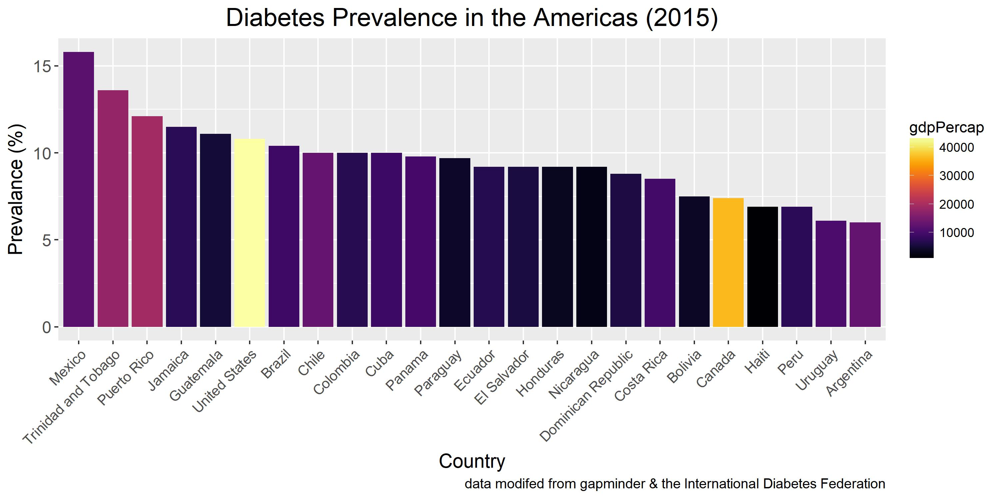

HW05: Factor and figure management; Repo hygiene
================

``` r
suppressPackageStartupMessages(library(gapminder))
suppressPackageStartupMessages(library(forcats))
```

    ## Warning: package 'forcats' was built under R version 3.4.2

``` r
suppressPackageStartupMessages(library(tidyverse))
```

    ## Warning: package 'tidyverse' was built under R version 3.4.2

Factor Management
=================

### Drop Oceania

I will work with gapminder. So the first task is to drop Oceania:

``` r
gapminder_no_Oceania <- gapminder %>% 
  filter(continent != "Oceania")
  
levels(gapminder$continent)  
```

    ## [1] "Africa"   "Americas" "Asia"     "Europe"   "Oceania"

``` r
str(gapminder$country)
```

    ##  Factor w/ 142 levels "Afghanistan",..: 1 1 1 1 1 1 1 1 1 1 ...

``` r
levels(gapminder_no_Oceania$continent)
```

    ## [1] "Africa"   "Americas" "Asia"     "Europe"   "Oceania"

``` r
str(gapminder_no_Oceania$country)
```

    ##  Factor w/ 142 levels "Afghanistan",..: 1 1 1 1 1 1 1 1 1 1 ...

``` r
nrow(gapminder)
```

    ## [1] 1704

``` r
nrow(gapminder_no_Oceania)
```

    ## [1] 1680

Here we see after filtering out Oceania, the factor continent still includes all 5 continents and the factor country still includes all 142 countries. The number of levels has not changed yet. But the data table does include fewer rows, indicating the filter was successful.

``` r
### give the version we're about to fix a new name
gapminder_no_OceaniaFixed <- gapminder_no_Oceania 
gapminder_no_OceaniaFixed$continent <- gapminder_no_Oceania$continent %>%
  fct_drop()

### now do the same for countries
gapminder_no_OceaniaFixed$country <- gapminder_no_Oceania$country %>%
  fct_drop()

levels(gapminder_no_OceaniaFixed$continent)
```

    ## [1] "Africa"   "Americas" "Asia"     "Europe"

``` r
str(gapminder_no_OceaniaFixed$continent)
```

    ##  Factor w/ 4 levels "Africa","Americas",..: 3 3 3 3 3 3 3 3 3 3 ...

``` r
### can also look at this with fct_count
fct_count(gapminder_no_OceaniaFixed$continent)
```

    ## # A tibble: 4 x 2
    ##          f     n
    ##     <fctr> <int>
    ## 1   Africa   624
    ## 2 Americas   300
    ## 3     Asia   396
    ## 4   Europe   360

``` r
str(gapminder_no_OceaniaFixed$country)
```

    ##  Factor w/ 140 levels "Afghanistan",..: 1 1 1 1 1 1 1 1 1 1 ...

``` r
nrow(gapminder_no_OceaniaFixed)
```

    ## [1] 1680

The above shows I was able to remove Oceania using fct\_drop. I removed the extra countries as well using a similar process. It appears there are now 2 less countries. Removing the extras from the factor did not effect the number of rows, as the filter had already removed extra rows. Let's double check in the original gapminder that there were only 2 countries in Oceania (140 from 142 above):

``` r
### check which countries are in original gapminder in Oceania 
gapminder %>% 
  filter(continent == "Oceania") %>% 
  group_by(country) %>% 
  summarize()
```

    ## # A tibble: 2 x 1
    ##       country
    ##        <fctr>
    ## 1   Australia
    ## 2 New Zealand

``` r
### check that these countries are not in gapminder_no_OceaniaFixed
gapminder_no_OceaniaFixed %>% 
  filter(country == "Australia" | country == "New Zealand") %>% 
  group_by(country) %>% 
  summarize()
```

    ## # A tibble: 0 x 1
    ## # ... with 1 variables: country <fctr>

``` r
## check that these countries are not in the factor levels, comparing our unfixed and fixed gapminder_no_Oceania
c("New Zealand", "Australia") %in% levels(gapminder_no_Oceania$country)
```

    ## [1] TRUE TRUE

``` r
c("New Zealand", "Australia") %in% levels(gapminder_no_OceaniaFixed$country)
```

    ## [1] FALSE FALSE

This confirms that there were only 2 countries, Australia and New Zealand, in the original gapminder, and they are not in our gapminder\_no\_OceaniaFixed. So we have successfully dropped Oceania and associated countries from the factors continent and country.

### Reorder the levels of country or continent

Lets reorder the levels of country by the percent diabetes prevalence in 2015, which I also used in HW04. This seemed like a cool idea since I work in a diabetes research lab.

``` r
diabetes_rates <- read.csv("diabtes_ratesedit.csv") %>% 
  rename(country = Country_Name) ### rename so diabetes_rates has the same column name as gapminder

head(diabetes_rates)
```

    ##       country Diabetes_prevalance_2015
    ## 1       Aruba                 11.70000
    ## 2 Afghanistan                  8.80000
    ## 3      Angola                  4.10000
    ## 4     Albania                 10.30000
    ## 5     Andorra                  8.50000
    ## 6  Arab World                 11.91781

``` r
### merge with gapminder
gapminder_diabetes <- left_join(gapminder_no_OceaniaFixed, diabetes_rates) 
```

    ## Joining, by = "country"

    ## Warning: Column `country` joining factors with different levels, coercing
    ## to character vector

``` r
str(gapminder_diabetes)  ### shows country is now chr instead of factor
```

    ## Classes 'tbl_df', 'tbl' and 'data.frame':    1680 obs. of  7 variables:
    ##  $ country                 : chr  "Afghanistan" "Afghanistan" "Afghanistan" "Afghanistan" ...
    ##  $ continent               : Factor w/ 4 levels "Africa","Americas",..: 3 3 3 3 3 3 3 3 3 3 ...
    ##  $ year                    : int  1952 1957 1962 1967 1972 1977 1982 1987 1992 1997 ...
    ##  $ lifeExp                 : num  28.8 30.3 32 34 36.1 ...
    ##  $ pop                     : int  8425333 9240934 10267083 11537966 13079460 14880372 12881816 13867957 16317921 22227415 ...
    ##  $ gdpPercap               : num  779 821 853 836 740 ...
    ##  $ Diabetes_prevalance_2015: num  8.8 8.8 8.8 8.8 8.8 8.8 8.8 8.8 8.8 8.8 ...

``` r
### change country back to factor
gapminder_diabetes$country = factor(gapminder_diabetes$country)

### reorder countries from high to low diabetes prevalence
gapminder_diabetes_sort <- gapminder_diabetes
gapminder_diabetes_sort$country <- fct_reorder(gapminder_diabetes$country, 
            gapminder_diabetes$Diabetes_prevalance_2015, 
            .desc = TRUE)

### now compare order before and after fct_reorder() to confirm the change
levels(gapminder_diabetes$country) %>% 
  head()
```

    ## [1] "Afghanistan" "Albania"     "Algeria"     "Angola"      "Argentina"  
    ## [6] "Austria"

``` r
levels(gapminder_diabetes_sort$country) %>% 
  head()
```

    ## [1] "Mauritius"    "Kuwait"       "Saudi Arabia" "Bahrain"     
    ## [5] "Malaysia"     "Mexico"

``` r
str(gapminder_diabetes_sort$country)   ### confirms still have the same number of factors
```

    ##  Factor w/ 140 levels "Mauritius","Kuwait",..: 40 40 40 40 40 40 40 40 40 40 ...

File I/O
========

Now lets save this to a file and load it again, to see if the ordering of the levels changes.

``` r
write.csv(gapminder_diabetes_sort, file = "gapminder_diabetes_sort.csv")

gapminder_diabetes_sort_csv <- read.csv("gapminder_diabetes_sort.csv")

str(gapminder_diabetes_sort_csv)
```

    ## 'data.frame':    1680 obs. of  8 variables:
    ##  $ X                       : int  1 2 3 4 5 6 7 8 9 10 ...
    ##  $ country                 : Factor w/ 140 levels "Afghanistan",..: 1 1 1 1 1 1 1 1 1 1 ...
    ##  $ continent               : Factor w/ 4 levels "Africa","Americas",..: 3 3 3 3 3 3 3 3 3 3 ...
    ##  $ year                    : int  1952 1957 1962 1967 1972 1977 1982 1987 1992 1997 ...
    ##  $ lifeExp                 : num  28.8 30.3 32 34 36.1 ...
    ##  $ pop                     : int  8425333 9240934 10267083 11537966 13079460 14880372 12881816 13867957 16317921 22227415 ...
    ##  $ gdpPercap               : num  779 821 853 836 740 ...
    ##  $ Diabetes_prevalance_2015: num  8.8 8.8 8.8 8.8 8.8 8.8 8.8 8.8 8.8 8.8 ...

``` r
levels(gapminder_diabetes_sort_csv$country) %>% 
  head()
```

    ## [1] "Afghanistan" "Albania"     "Algeria"     "Angola"      "Argentina"  
    ## [6] "Austria"

There seems to be 2 changes. A new column has been added, named "X", which has the row number. The factor countries is also no longer ordered by diabetes prevalence. It was reordered back to alphabetic.

Let's save it to a file and reopen it again, this time using saveRDS()/readRDS().

``` r
saveRDS(gapminder_diabetes_sort, file = "gapminder_diabetes_sort.rds")

gapminder_diabetes_sort_RDS <- readRDS("gapminder_diabetes_sort.rds")

str(gapminder_diabetes_sort_RDS)
```

    ## Classes 'tbl_df', 'tbl' and 'data.frame':    1680 obs. of  7 variables:
    ##  $ country                 : Factor w/ 140 levels "Mauritius","Kuwait",..: 40 40 40 40 40 40 40 40 40 40 ...
    ##  $ continent               : Factor w/ 4 levels "Africa","Americas",..: 3 3 3 3 3 3 3 3 3 3 ...
    ##  $ year                    : int  1952 1957 1962 1967 1972 1977 1982 1987 1992 1997 ...
    ##  $ lifeExp                 : num  28.8 30.3 32 34 36.1 ...
    ##  $ pop                     : int  8425333 9240934 10267083 11537966 13079460 14880372 12881816 13867957 16317921 22227415 ...
    ##  $ gdpPercap               : num  779 821 853 836 740 ...
    ##  $ Diabetes_prevalance_2015: num  8.8 8.8 8.8 8.8 8.8 8.8 8.8 8.8 8.8 8.8 ...

``` r
levels(gapminder_diabetes_sort_RDS$country) %>% 
  head()
```

    ## [1] "Mauritius"    "Kuwait"       "Saudi Arabia" "Bahrain"     
    ## [5] "Malaysia"     "Mexico"

Interestingly, saveRDS()/readRDS() preserved the order of the factor country, unlike read/write.csv(). It also did not add a column X.

Visualization design
====================

Lets look at diabetes prevalence in the America's.

``` r
myplot <- function(my_data_table) {  
  filter(my_data_table, year == 2007) %>%  ## so have 1 entry per country
  filter(continent == "Americas") %>%
  filter(country != "Venezuela") %>% ### remove venezuela b/c is NA
  ggplot(aes(x = country, y = Diabetes_prevalance_2015)) +
  geom_col(aes(fill = country)) +
  ggtitle("Diabetes Prevalence in the Americas (2015)") +
  labs(y = "Prevalance (%)", 
       x = "Country",
        caption = "data modifed from gapminder & the International Diabetes Federation") +
  theme(axis.text.x=element_text(angle=45,hjust=1)) +
  theme(axis.title = element_text(size=14),
        plot.title = element_text(hjust = 0.5, size=18),
        axis.text.x = element_text(size=10),
        axis.text.y = element_text(size=12)) +
  scale_fill_manual(values = gapminder::country_colors) +
  theme(legend.position="none") ### remove the legend 
    
}  

gapminder_diabetes_sort %>% 
  myplot()
```

 Venezuela showed up as blank because the country's name in the diabetes datatable was slightly different than in gapminder, and so it's value is listed as NA. Therefore I filtered it out from the graph.

We can see above that the countries are sorted from highest to lowest prevelance. This is helpful to convey the information, as mentioned by Tamara Munzner. I did not have to use arrange to sort it, as it kept the order of the levels in country.

I used the color scheme that comes with gapminder. Not sure I understand it though. Anyways, from the graph we can see Mexico had the highest prevelance of diabetes, and Argentina had the lowest. Canada was towards the low end.

As I want to show this plot multiple times in a row (with slightly different inputs) I saved the plot settings to a function.

Now lets do the same plot using the datatable read from the csv file. I expect the countries to be sorted alphabetically:

``` r
gapminder_diabetes_sort_csv %>% 
  myplot()
```


Now lets take the csv version again, and lets arrange by diabetes prevelance using arrange().

``` r
gapminder_diabetes_sort_csv %>% 
  arrange(Diabetes_prevalance_2015) %>% 
  myplot()
```

 It appears arrange does not effect the graph. The countries are still in alphabetical order. I tried it serveral different ways, but it appears arrange() does not effect the layout of the graph.

``` r
gapminder_diabetes_sort_csv %>% 
  arrange(Diabetes_prevalance_2015) %>% 
  filter(year == 2007) %>%  ## so have 1 entry per country
  filter(continent == "Americas") %>%
  filter(country != "Venezuela") %>% ### remove venezuela b/c is NA
  head(10) %>% 
  myplot()
```

 Arrange sorts the datatable. So we can pass arrange into head, to select only 10 countries with the lowest diabetes prevalence. Then we can graph these 10 countries. The graph is still sorted alphabetically, but thanks to arrange() the 10 selected countries are the 10 with lowest diabetes rate. So in this way arrange was able to effect the graph. But the point still stands, the order in which the items are displayed on the graph is determined by the levels in the factor country, and arrange cannot override this.

Writing figures to file
=======================

Lets save our plot to a file using ggsave:

``` r
diabetes_plot <- gapminder_diabetes_sort %>% 
  myplot()

### Putting a random plot here that I am not interested in saving.
wrong_plot <- gapminder %>% 
ggplot(aes(x = country, y = lifeExp)) +
  geom_col()

ggsave("diabetes_plot.svg") 
```

    ## Saving 7 x 5 in image

``` r
ggsave("diabetes_plot2.svg", plot = diabetes_plot)
```

    ## Saving 7 x 5 in image

It appears ggsave automatically saves the most recently made plot. We need to specify the plot name explicitly to make sure it saves the correct plot.

Now lets load the files to see if the save worked properly:

**diabetes\_plot** 

**diabetes\_plot2** 

We can also try saving it as a .jpg:

``` r
ggsave("diabetes_plot3.jpg", plot = diabetes_plot, dpi = 300) 
```

    ## Saving 7 x 5 in image

**diabetes\_plot3** 

This confirms what I mentioned above about the imporatance of specifying the plot you would like to save, especially if it is not the most recent plot.

Reflection
==========

I found [this page](http://stat545.com/block029_factors.html) from class quite helpful for this assignment.

I had never written a function in R before, but after a bit of time on google I manged to figure it out. At first I tried to save the graph as an object, but that didn't work (don't think it's possible to do this). Then I thought a function might work. It was super helpful because I didn't want to copy and paste a massive block of code over and over. I found [this page](https://www.statmethods.net/management/userfunctions.html) helpful for how to write a function.

I was also very confused when playing around with arrange(). I thought I was doing something wrong, but it turned out it was working properly from the beginning. It's just that arrange() does not directly effect the display order for items in a plot. I was able to understand this by examining the effect of arrange() on a datatable and also when piping into head().

Also kids, don't finsih your stats homowork mere minutes before it's due. I almost crashed R and deleted the my Rproject, freaked out, but just mangaged to fix it in time... :thumbsup:
