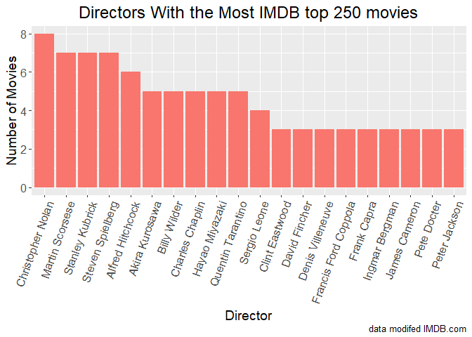

HW10: Scraping data from the web
================

For my final STAT 547 assignment, I will scrape the IMDB top 250 movies page.

We will use `rvest` (which includes `xml2`) to acquire the data.

Load Packages
-------------

``` r
suppressPackageStartupMessages(library(rvest))
suppressPackageStartupMessages(library(dplyr))
suppressPackageStartupMessages(library(knitr))
suppressPackageStartupMessages(library(glue))
suppressPackageStartupMessages(library(magrittr))
suppressPackageStartupMessages(library(purrr))
suppressPackageStartupMessages(library(stringr))
suppressPackageStartupMessages(library(data.table))
suppressPackageStartupMessages(library(ggplot2))
suppressPackageStartupMessages(library(forcats))
suppressPackageStartupMessages(library(readr))
```

Lets get the list of all 250 movie titles
-----------------------------------------

``` r
# save the url to imdb page with top 250 movie list
imdb_top250_url <- "http://www.imdb.com/chart/top?ref_=nv_mv_250_6"

# save raw list containing movie titles and other information
movie_titles <- read_html(imdb_top250_url) %>% 
    html_nodes(css = "a") %>%   ## extract html attribute containing movie titles
    html_text()

# check the length of the output list
length(movie_titles)
```

    ## [1] 646

``` r
# examine beginning of list showing extra information
movie_titles %>% 
  head(10) %>% 
    kable()
```

    ## Warning in kable_markdown(x = structure(c("", "IMDb", "More", "Movies", :
    ## The table should have a header (column names)

|                              |
|:-----------------------------|
|                              |
| IMDb                         |
| More                         |
| Movies                       |
| TV                           |
| Showtimes                    |
|                              |
| The Dark Knight              |
| (2008)                       |
| \#4 on IMDb Top Rated Movies |
| In Theaters                  |

``` r
# examine middle of list showing movie titles and blank entries
kable(movie_titles[76:86])
```

    ## Warning in kable_markdown(x = structure(c("The Shawshank Redemption", "", :
    ## The table should have a header (column names)

|                          |
|:-------------------------|
| The Shawshank Redemption |
|                          |
| The Godfather            |
|                          |
| The Godfather: Part II   |
|                          |
| The Dark Knight          |
|                          |
| 12 Angry Men             |
|                          |
| Schindler's List         |

As we can see, the above list includes the movie titles, but also has a lot of blanks and extra information.

I had to play around a bit to figure out the correct `css` to use in `html_nodes()`. It turned out to be just `"a"`, which I had overlooked at first because while I saw `"a"` in the html code, I didn't know what it means/stands for and I'm actually still a bit surprised it worked.

``` r
# save only rows 71-569 which contain movie titles to drop other information 
movie_df <- NA ## added this line due to error in knitting
movie_df[] <- data.frame(Movie_Titles = movie_titles[76:574]) %>%   ## [] keeps output of lapply as a list
    filter(Movie_Titles != " ") %>%  ## filter out blank rows
    lapply(as.character, stringsAsFactors = FALSE)  ## conver factor column to chr


# add a row with th IMDB ranking number
movie_df <- data.frame(Movie_Titles = movie_df[[1]]) %>%  ## added data.frame() due to knitting error
    mutate(IMDB_Ranking = row_number())

movie_df %>% 
    head(5) %>% 
  kable()
```

| Movie\_Titles            |  IMDB\_Ranking|
|:-------------------------|--------------:|
| The Shawshank Redemption |              1|
| The Godfather            |              2|
| The Godfather: Part II   |              3|
| The Dark Knight          |              4|
| 12 Angry Men             |              5|

Now we have a datatable with 250 rows, 1 row for each of the 250 movies. The table is in descending order of the IMDB movie ranking, and I added a column to store the IMDB ranking so we can use it for data analysis later.

Get links to page for each movie
--------------------------------

Next lets add links to the IMDB page for each movie as a new column:

``` r
# extract html attribute containing movie titles
link_df <- read_html(imdb_top250_url) %>% 
    html_nodes(css = "a") %>%   
  html_attr('href')

# drop extra rows and convert to dataframe
movie_urls_df <- data.frame(partial_url = link_df[76:574]) # same row numbers as used for movie titles

# drop extra rows and format urls
movie_urls_df <- data.frame(partial_url = movie_urls_df[1]) %>% 
    unique() %>%    ## each url appeared twice, so remove duplicates
    mutate(Link = glue("http://www.imdb.com{partial_url}")) %>%  # add domain to get full url
    mutate(IMDB_Ranking = row_number()) ## add the IMDB ranking here too, so can merge with movie_title dataframe

# merge movie title and url dataframe
movie_df_merged <- inner_join(movie_df, movie_urls_df, by = "IMDB_Ranking") %>% 
    select(IMDB_Ranking, Movie_Titles, Link) # reorder columns and drop partial_url column


# view table
movie_df_merged %>% 
    head(5) %>% 
  kable()
```

|  IMDB\_Ranking| Movie\_Titles            | Link                                                                                                                                                                     |
|--------------:|:-------------------------|:-------------------------------------------------------------------------------------------------------------------------------------------------------------------------|
|              1| The Shawshank Redemption | <http://www.imdb.com/title/tt0111161/?pf_rd_m=A2FGELUUNOQJNL&pf_rd_p=3376940102&pf_rd_r=0RTPSFR6A0M385YPJS6V&pf_rd_s=center-1&pf_rd_t=15506&pf_rd_i=top&ref_=chttp_tt_1> |
|              2| The Godfather            | <http://www.imdb.com/title/tt0068646/?pf_rd_m=A2FGELUUNOQJNL&pf_rd_p=3376940102&pf_rd_r=0RTPSFR6A0M385YPJS6V&pf_rd_s=center-1&pf_rd_t=15506&pf_rd_i=top&ref_=chttp_tt_2> |
|              3| The Godfather: Part II   | <http://www.imdb.com/title/tt0071562/?pf_rd_m=A2FGELUUNOQJNL&pf_rd_p=3376940102&pf_rd_r=0RTPSFR6A0M385YPJS6V&pf_rd_s=center-1&pf_rd_t=15506&pf_rd_i=top&ref_=chttp_tt_3> |
|              4| The Dark Knight          | <http://www.imdb.com/title/tt0468569/?pf_rd_m=A2FGELUUNOQJNL&pf_rd_p=3376940102&pf_rd_r=0RTPSFR6A0M385YPJS6V&pf_rd_s=center-1&pf_rd_t=15506&pf_rd_i=top&ref_=chttp_tt_4> |
|              5| 12 Angry Men             | <http://www.imdb.com/title/tt0050083/?pf_rd_m=A2FGELUUNOQJNL&pf_rd_p=3376940102&pf_rd_r=0RTPSFR6A0M385YPJS6V&pf_rd_s=center-1&pf_rd_t=15506&pf_rd_i=top&ref_=chttp_tt_5> |

Now we have added the links to the IMDB page for each movie. We can now go to this url and get more data about each movie.

``` r
# function to get the director for each movie
get_director <- function(movie_url){
    Directors_writers <- read_html(movie_url)  %>%   ## extract html attribute containing movie titles
    html_nodes(".credit_summary_item .itemprop") %>%    
    html_text()
    return(Directors_writers[1])
}

# iterate over each movie and call the get_director function
movie_df_merged %<>%     ### this symbol is equiv to <- and %>%  together
    mutate(Director = map_chr(Link, get_director))


# function to get the gross USA $ earnings for each movie
get_gross_USA <- function(movie_url){
    raw_gross_usa <- data.frame(x = 
                                                        read_html(movie_url)  %>%
                                                        html_nodes(".txt-block") %>%    
                                                        html_text()) %>% 
    mutate(lots_of_info = as.character(x)) %>%   # convert factor to character in new column
    mutate(T_or_F = grepl("Gross USA", lots_of_info)) %>%  # create new column to identify with row has the Gross USA value
    filter(T_or_F == TRUE) # filter to select the single row that contain the gross USA earnings
    row_count <- nrow(raw_gross_usa) # check if a gross USA was identified for each movie
    if (row_count == 0)
        return(NA) # if no gross USA is available, return NA
    parse_number(raw_gross_usa$lots_of_info) %>%  # extract gross USA value from a string
    return()
}

# iterate over each movie and call the get_gross_USA() function
movie_df_merged_GROSS <-  movie_df_merged %>%      ### this symbol is equiv to <- and %>%  together
    mutate(Gross_USA = map_chr(Link, get_gross_USA))

# convert gross USA from character to numeric
movie_df_merged_GROSS %<>% 
    mutate(Gross_USA = as.numeric(Gross_USA))

# View final table
movie_df_merged_GROSS %>% 
  head(10) %>% 
  kable()
```

|  IMDB\_Ranking| Movie\_Titles                                 | Link                                                                                                                                                                      | Director             |  Gross\_USA|
|--------------:|:----------------------------------------------|:--------------------------------------------------------------------------------------------------------------------------------------------------------------------------|:---------------------|-----------:|
|              1| The Shawshank Redemption                      | <http://www.imdb.com/title/tt0111161/?pf_rd_m=A2FGELUUNOQJNL&pf_rd_p=3376940102&pf_rd_r=0RTPSFR6A0M385YPJS6V&pf_rd_s=center-1&pf_rd_t=15506&pf_rd_i=top&ref_=chttp_tt_1>  | Frank Darabont       |    28341469|
|              2| The Godfather                                 | <http://www.imdb.com/title/tt0068646/?pf_rd_m=A2FGELUUNOQJNL&pf_rd_p=3376940102&pf_rd_r=0RTPSFR6A0M385YPJS6V&pf_rd_s=center-1&pf_rd_t=15506&pf_rd_i=top&ref_=chttp_tt_2>  | Francis Ford Coppola |   134966411|
|              3| The Godfather: Part II                        | <http://www.imdb.com/title/tt0071562/?pf_rd_m=A2FGELUUNOQJNL&pf_rd_p=3376940102&pf_rd_r=0RTPSFR6A0M385YPJS6V&pf_rd_s=center-1&pf_rd_t=15506&pf_rd_i=top&ref_=chttp_tt_3>  | Francis Ford Coppola |    57300000|
|              4| The Dark Knight                               | <http://www.imdb.com/title/tt0468569/?pf_rd_m=A2FGELUUNOQJNL&pf_rd_p=3376940102&pf_rd_r=0RTPSFR6A0M385YPJS6V&pf_rd_s=center-1&pf_rd_t=15506&pf_rd_i=top&ref_=chttp_tt_4>  | Christopher Nolan    |   534858444|
|              5| 12 Angry Men                                  | <http://www.imdb.com/title/tt0050083/?pf_rd_m=A2FGELUUNOQJNL&pf_rd_p=3376940102&pf_rd_r=0RTPSFR6A0M385YPJS6V&pf_rd_s=center-1&pf_rd_t=15506&pf_rd_i=top&ref_=chttp_tt_5>  | Sidney Lumet         |          NA|
|              6| Schindler's List                              | <http://www.imdb.com/title/tt0108052/?pf_rd_m=A2FGELUUNOQJNL&pf_rd_p=3376940102&pf_rd_r=0RTPSFR6A0M385YPJS6V&pf_rd_s=center-1&pf_rd_t=15506&pf_rd_i=top&ref_=chttp_tt_6>  | Steven Spielberg     |    96067179|
|              7| Pulp Fiction                                  | <http://www.imdb.com/title/tt0110912/?pf_rd_m=A2FGELUUNOQJNL&pf_rd_p=3376940102&pf_rd_r=0RTPSFR6A0M385YPJS6V&pf_rd_s=center-1&pf_rd_t=15506&pf_rd_i=top&ref_=chttp_tt_7>  | Quentin Tarantino    |   107928762|
|              8| The Lord of the Rings: The Return of the King | <http://www.imdb.com/title/tt0167260/?pf_rd_m=A2FGELUUNOQJNL&pf_rd_p=3376940102&pf_rd_r=0RTPSFR6A0M385YPJS6V&pf_rd_s=center-1&pf_rd_t=15506&pf_rd_i=top&ref_=chttp_tt_8>  | Peter Jackson        |   377845905|
|              9| Il buono, il brutto, il cattivo               | <http://www.imdb.com/title/tt0060196/?pf_rd_m=A2FGELUUNOQJNL&pf_rd_p=3376940102&pf_rd_r=0RTPSFR6A0M385YPJS6V&pf_rd_s=center-1&pf_rd_t=15506&pf_rd_i=top&ref_=chttp_tt_9>  | Sergio Leone         |     6100000|
|             10| Fight Club                                    | <http://www.imdb.com/title/tt0137523/?pf_rd_m=A2FGELUUNOQJNL&pf_rd_p=3376940102&pf_rd_r=0RTPSFR6A0M385YPJS6V&pf_rd_s=center-1&pf_rd_t=15506&pf_rd_i=top&ref_=chttp_tt_10> | David Fincher        |    37030102|

Here we have gotten the director for each movie, and also its $USD gross earnings in the USA. The former was fairly straight forward, but the latter proved very challenging, and my solution is admittedly not the cleanest. Movies that did not have a gross USA earnings are given an `NA` in the datatable (34 out of the 250 movies do not have gross USA info).

-   The raw output from my html query for gross USA earnings was a list of 22 items, one of which was `"\nGross USA: $28,341,469\n"`. I converted the list to a dataframe, extracted the row containing this line, and then extracted the numbers from this row using `parse_number()` from the `readr` package.

-   The if statement ensures the function did not crash for the 34 movies that did not have a gross USA earnings listed.

I also think it's possible to shorten the URL's and still be able to get to the correct site, if I was to do this assignment again from the beginning.

Graphical Analysis
------------------

Let's take a look to see which directors are the most popular:

``` r
director_summary <- movie_df_merged_GROSS %>% 
    count(Director) %>% 
    arrange(desc(n)) %>%
    head(20)

director_summary$Director <- fct_reorder(director_summary$Director, director_summary$n, .desc = TRUE)

director_summary %>% 
    ggplot(aes(x = Director, y = n, fill = "blue")) +
  geom_col() +
  ggtitle("Directors With the Most IMDB top 250 movies") +
  labs(y = "Number of Movies",
       x = "Director",
        caption = "data modifed IMDB.com") +
  theme(axis.text.x=element_text(angle=70,hjust=1)) +
  theme(axis.title = element_text(size=14),
        plot.title = element_text(hjust = 0.5, size=18),
        axis.text.x = element_text(size=12),
        axis.text.y = element_text(size=12)) +
    theme(legend.position="none")
```



I didn't expect Christopher Nolan to be at the top of my list, but he's actually my favorite director, so I'm not complaining :).

Now lets also examine if there's a relationship between gross earnings and movie ranking:

``` r
movie_df_merged_GROSS %>% 
    filter(!is.na(Gross_USA)) %>% ## filter out movies without gross earnings info
    ggplot(aes(x = IMDB_Ranking, y = Gross_USA)) +
    geom_point(colour = 3) +
    scale_y_log10() +
    ggtitle("Gross USA Movie earnings vs IMDB ranking") +
  labs(y = "Log10 Gross USA Earnings ($USD)",
       x = "IMDB Movie Ranking",
        caption = "data modifed IMDB.com") +
  theme(axis.text.x=element_text(angle=70,hjust=1)) +
  theme(axis.title = element_text(size=14),
        plot.title = element_text(hjust = 0.5, size=18),
        axis.text.x = element_text(size=12),
        axis.text.y = element_text(size=12))
```


There does not seem to be much of a correlation here. In the future it would be interesting to also consider the year in which the movies were released, and to see if adjusting for inflation changes anythings.

All done!! Cheers.
